# EcoLoco

**A living, explorable rainforest on top of [Virtual Ecosystem](https://github.com/ImperialCollegeLondon/virtual_ecosystem),
with a user interface for every parameter, input and simulation. It runs in the browser, with nothing to install.**

**▶ Try it: [majaus.es/ecoloco](https://majaus.es/ecoloco/)**

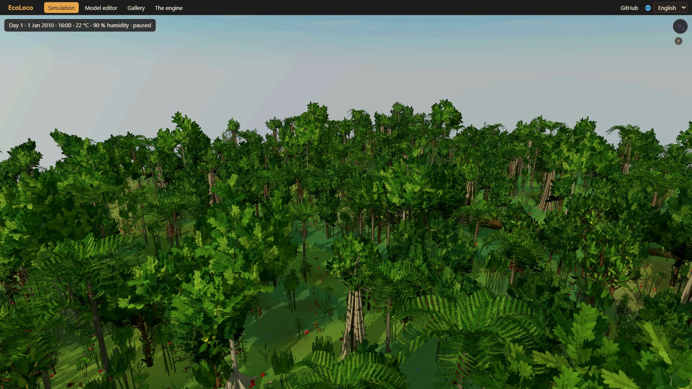

[Virtual Ecosystem](https://github.com/ImperialCollegeLondon/virtual_ecosystem) is the holistic
ecosystem model developed at Imperial College London. It simulates a whole forest as coupled
modules: plants, animals, soil, leaf litter, hydrology and the microclimate under the canopy,
cell by cell over a grid. It is a powerful scientific tool, but it lives in Python scripts,
TOML files and netCDF outputs.

EcoLoco gives it the two things it did not have:

- **A visual layer.** The forest the engine computes becomes a 3D world you can walk through.
  Every animal is simulated as an individual, minute by minute: it eats where there is food,
  drinks, sleeps at its hour, flees, stalks and hunts, courts, digs and nests. Day by day it
  matches what the engine says: who is born, who dies, who is eaten and how much is eaten.
- **An interface for everything.** Every engine parameter, animal and plant type, climate
  input and simulation can be edited, run, charted and exported from the browser.

Underneath there is the engine itself: Virtual Ecosystem 0.2.2 **ported to plain JavaScript,
bit for bit**. It gives exactly the same outputs as the original in every case compared, and it
runs 5 to 15 times faster.

## What you can do

### Walk through a living rainforest

The scenario is the Maliau Basin (Sabah, Borneo), with its real daily climate for 2010–2020.
The trees and shrubs are the engine's plant cohorts at their real density and height. The
animals are 33 real species of Maliau, each standing in for one of the engine's functional
groups. There are day and night, clouds, rain, mist and a stream, and time runs from ×1 (a day lasts
24 minutes) up to as fast as the engine can compute.

Click any animal to follow it and open its card. The card says what it is doing and why
(hungry, thirsty, sleepy, fleeing from whom), its home and territory, and what it has done today.
Trees, shrubs and mushrooms can be clicked too.

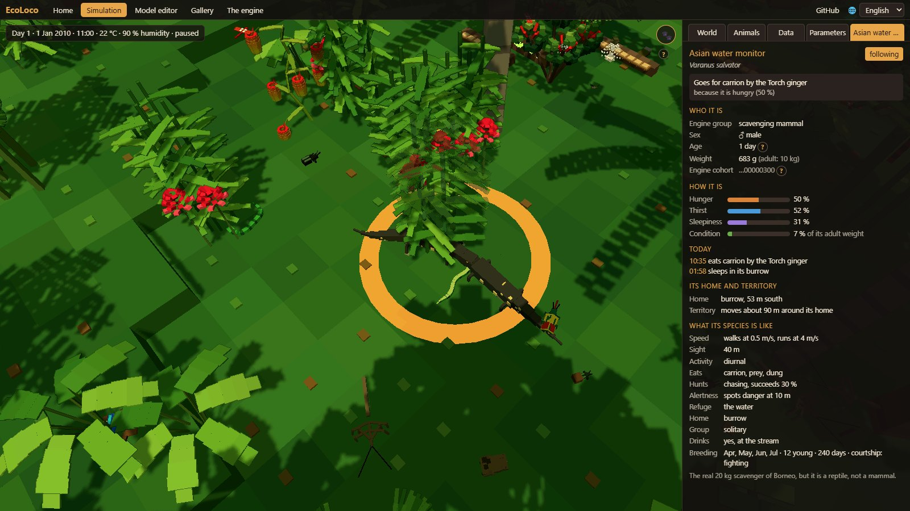

At night the glowing mushrooms light up, the fireflies come out and the nocturnal animals wake up.

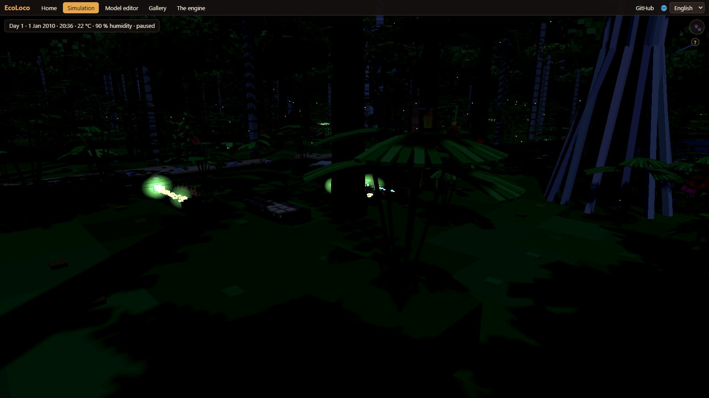

### Look inside the engine while it runs

The panel shows the engine's variables for the whole world day by day, with a chart for each one
(per layer when they have a vertical profile). It also shows every animal group: how many
individuals the engine has, how many are drawn and how many each drawn animal stands for.

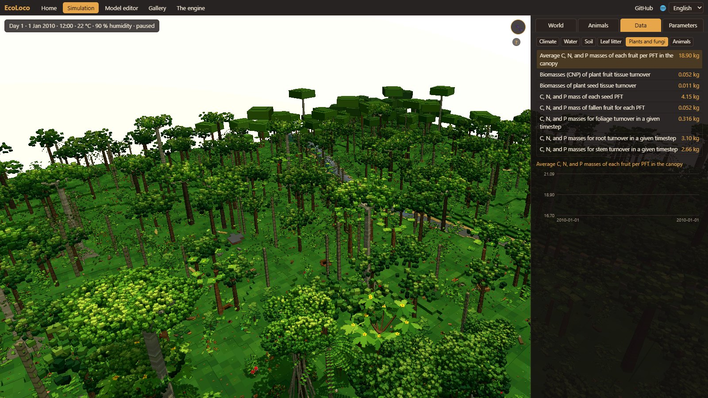

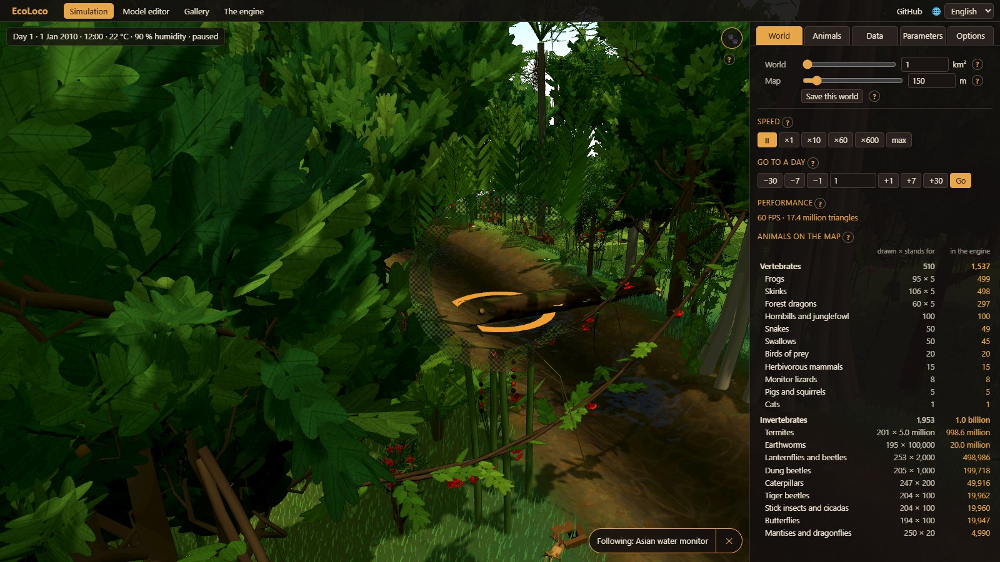

### Change the climate and see the future

Warmer or colder, more or less rain, humidity, CO₂, tree mortality and recruitment can all be
changed from tomorrow. Before applying a change, a prediction runs the engine ahead with and
without it, without touching your world.

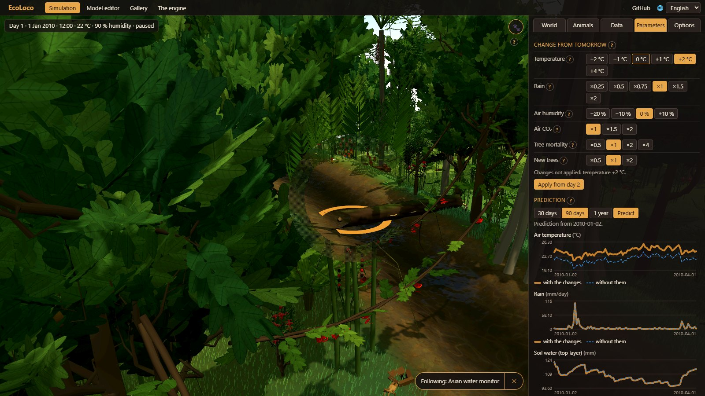

### Set up your own world

Choose the size of the forest the engine computes (1 to 10 km²) and of the map you see, the
river, ponds, the state of the forest, the climate and which species are present. You can start
from presets such as a clearing after a fire, a riverside or an El Niño dry year. Worlds can be
saved and opened again on the day you left them.

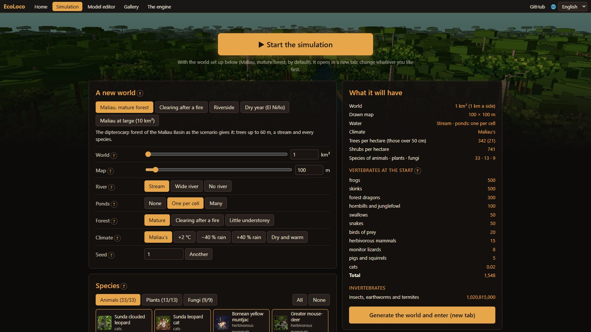

### Model editor and gallery

Every animal, plant and fungus of the simulation can be viewed one by one. The editor shows its
animations, its diet, where it lives in Borneo and how well it fits the engine group it
represents (and says so when there is no real equivalent and it is a stand-in). The gallery puts
the real photo of each species next to its model.

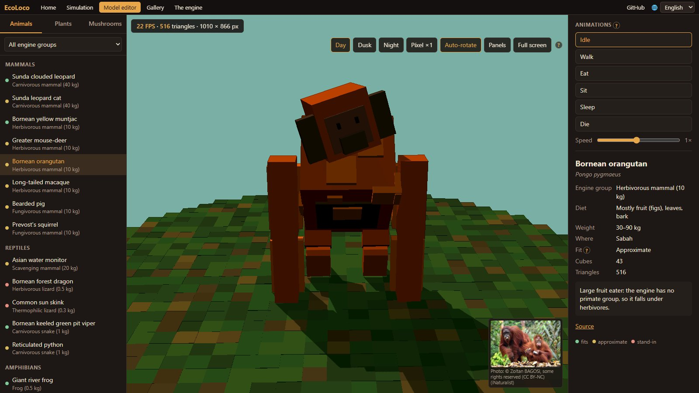

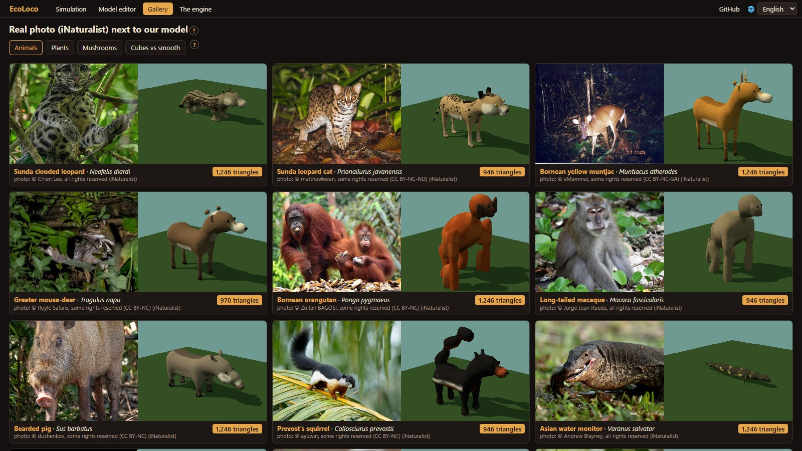

### The engine on its own

This is the full port of Virtual Ecosystem with an interface:
- choose a scenario;
- edit any of its 300+ configuration parameters, the animal functional groups, the plant types
  and cohorts, and the climate inputs;
- run it step by step;
- watch populations, biomass, litter, soil, water and temperature;
- explore any variable on the grid map, see who eats whom;
- export zarr and CSV files exactly like the original.

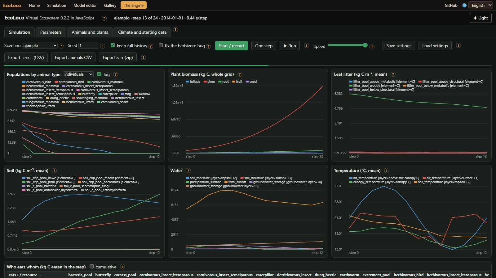

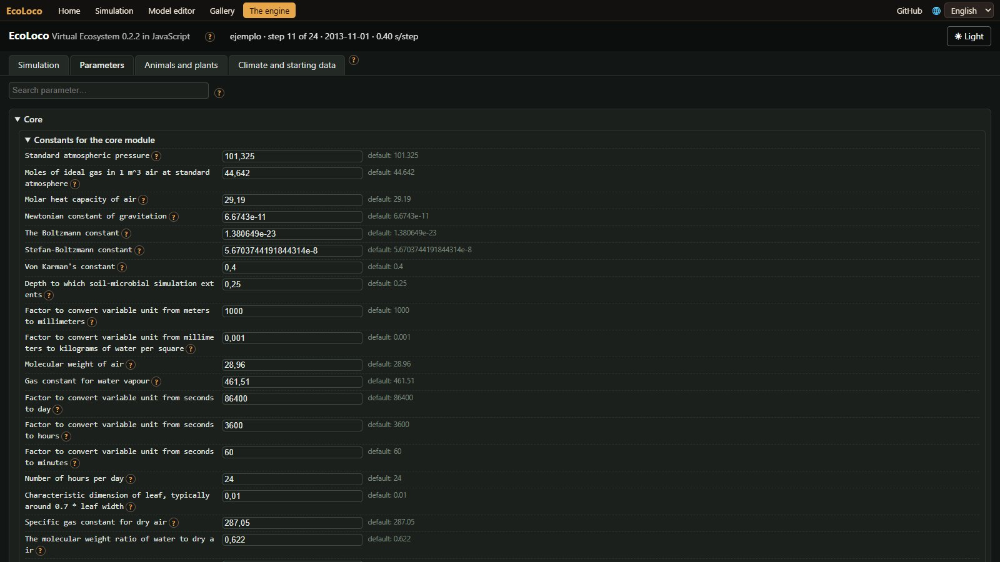

The whole application is in English and Spanish, works on phones and tablets (one finger turns
the camera, pinching moves forwards and backwards), and every control has a «?» that explains it.

## How faithful is it

- **The engine is bit for bit.** Every variable of the zarr output at every step, the animal
  CSVs (cohorts, trophic interactions, pools) and the plant CSVs are identical to the original.
  This was checked on the example scenario at monthly and daily steps, and on variants with
  other animals and plants, another climate, another grid and `abiotic_simple`.
- **Known issues of the original are kept.** Virtual Ecosystem 0.2.2 has a known problem with
  herbivores: with a daily time step no animal ever eats. The port reproduces it exactly. Fixes
  for it are included as an option, off by default, and the Maliau scenario uses them.
- **The living world is a layer on top.** The individuals are not part of Virtual Ecosystem.
  Each day they are reconciled with the engine's cohorts: births, deaths, kills and what is
  eaten. Where there are too many animals to draw, each drawn one stands for several engine
  individuals, and the interface always says how many.

## Credits

**Virtual Ecosystem** is developed at Imperial College London by Rob Ewers, David Orme,
Jacob Cook, Vivienne Groner, Taran Rallings, Sally Matson, Olivia Daniel, Jaideep Joshi,
Anna Rallings, Priyanga Amarasekare, Diego Alonso Alvarez and Alex Dewar.
Repository: [ImperialCollegeLondon/virtual_ecosystem](https://github.com/ImperialCollegeLondon/virtual_ecosystem).
If you use the model, please cite their work:

> Ewers, R. M., Cook, J., Daniel, O., Orme, D., Groner, V., Joshi, J., Rallings, A., Rallings, T.
> & Amarasekare, P. (2024). *New insights to be gained from a Virtual Ecosystem.* EcoEvoRxiv.
> [doi:10.32942/X26W5B](https://doi.org/10.32942/X26W5B)

EcoLoco is an independent project and is not affiliated with the Virtual Ecosystem team.

Also used, with thanks:
- [pyrealm](https://github.com/ImperialCollegeLondon/pyrealm) (David Orme, MIT): its P-model and
  T-model parts are ported too.
- [three.js](https://threejs.org/) (MIT), for the 3D.
- Climate: ERA5 and ERA5-Land from the Copernicus Climate Change Service, through
  [Open-Meteo](https://open-meteo.com/).
- Species photos: [iNaturalist](https://www.inaturalist.org/) observers, credited on each photo.

## License

[BSD 3-Clause](LICENSE), the same license as Virtual Ecosystem. The species photos are not
covered by it: each belongs to its author under the license shown with it. Third-party parts
are listed in [NOTICE](NOTICE).

## Technical details

To run it locally you only need Node 22. From the repository root, run `node interfaz/servidor.mjs`
and open <http://localhost:8090/>. The tests are `node --test pruebas/*.test.js`.

| Folder | What it is |
|---|---|
| `motor/` | The engine: Virtual Ecosystem 0.2.2 in plain JavaScript (ES modules, no dependencies). Runs in Node and in a Web Worker. |
| `interfaz/` | The engine interface, its worker, and a minimal static server. |
| `mundo/` | The living world without graphics: individuals, behaviour, the day minute by minute, reconciliation with the engine. |
| `vivo/` | The 3D page of the living world. |
| `graficos/pruebas-morta/borneo/` | The species models, the editor and the gallery. |
| `index.html`, `portada/`, `comun/` | Home page, world setup, shared header, languages and help. |
| `herramientas/` | Scenario conversion, the Python oracle and the bit-for-bit comparison suite. |
| `datos/escenarios/` | Ready-to-run scenarios (compiled configuration plus input data). |

Everything else is documented in Spanish:
- [docs/TECNICO.md](docs/TECNICO.md): how each part is launched, how new scenarios are converted
  from the original TOML files and how the bit-for-bit comparison is run.
- [informe/INFORME.md](informe/INFORME.md): the full report, with what matches, the herbivore fixes,
  sustainability runs, timings and every design decision.
