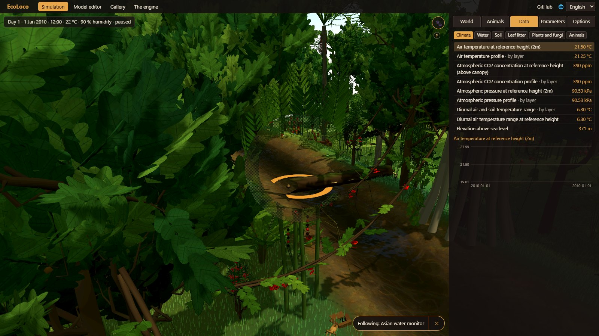
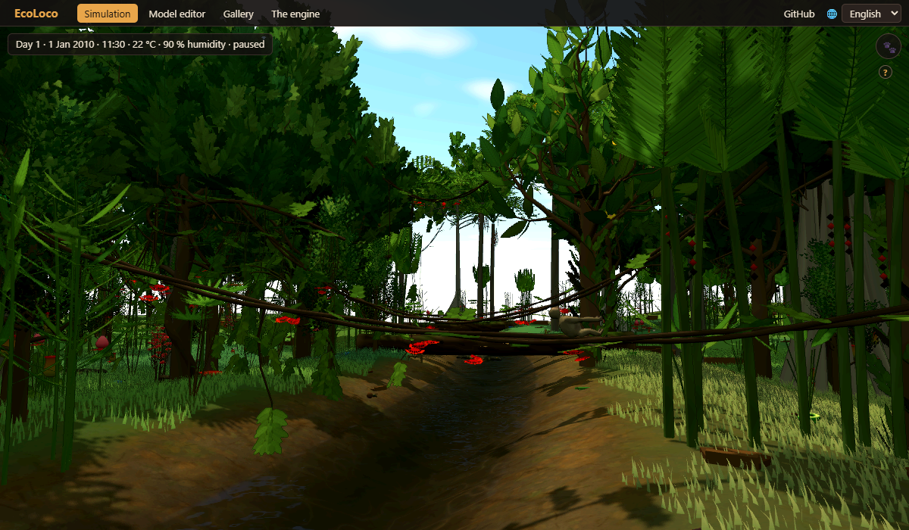
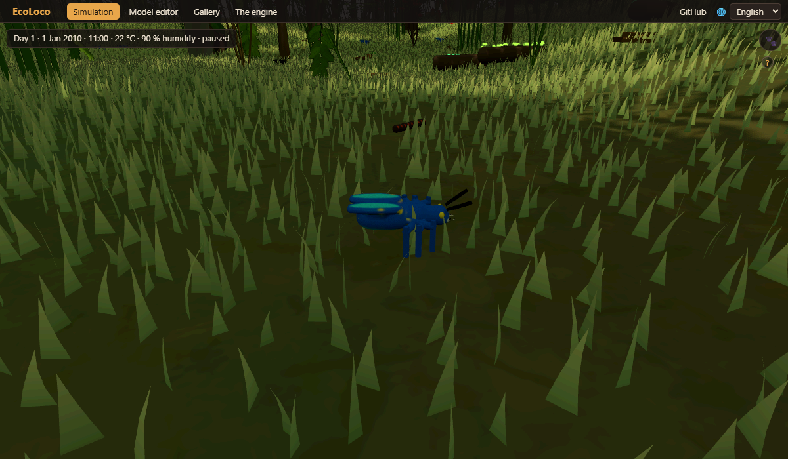
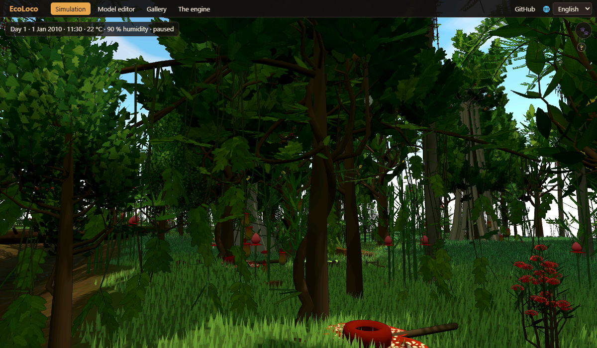

# EcoLoco

**[Virtual Ecosystem](https://github.com/ImperialCollegeLondon/virtual_ecosystem), the ecosystem model of
Imperial College London, ported to JavaScript: exactly the same results, bit for bit, and much faster.
With an interface for every parameter and chart, and a living rainforest in 3D where you can watch the
animals and plants of Borneo doing what the simulation says. It runs in the browser, with nothing to install.**

**▶ Try it: [majaus.es/ecoloco](https://majaus.es/ecoloco/)**

[Virtual Ecosystem](https://github.com/ImperialCollegeLondon/virtual_ecosystem) is the holistic
ecosystem model developed at Imperial College London. It simulates a whole forest as coupled
modules: plants, animals, soil, leaf litter, hydrology and the microclimate under the canopy,
cell by cell over a grid. It is a powerful scientific tool, but it lives in Python scripts,
TOML files and netCDF outputs.

EcoLoco brings three things:

1. **The same model, in JavaScript.** Virtual Ecosystem 0.2.2 rewritten module by module. It
   gives **exactly the same outputs as the original, bit for bit**, and it runs much faster.
2. **An interface for everything.** Every parameter, animal and plant type, climate input and
   simulation can be edited, run, charted and exported from the browser.
3. **A living world.** The forest the model computes becomes a 3D rainforest you can walk
   through, where every animal is simulated as an individual and, day by day, matches what the
   model says: who is born, who dies, who is eaten and how much is eaten.

## Identical to the original, and much faster

Every variable of the zarr output at every step, and the animal and plant CSVs, are identical
to those of the original Python, bit for bit. Measured on the same machine, one run after the other:

| Scenario | Original (Python) | Our engine (JavaScript) | Faster |
|---|---|---|---|
| Example, monthly steps (2 years, 9 × 9 cells) | 134.9 s | 13.2 s | **×10** |
| Example, daily steps (60 days, 9 × 9 cells) | 31 min 14 s | 38.0 s | **×49** |

Whole runs, from loading the data to writing every output, measured one after the other on the same computer (Ryzen 9 5900X, Windows 11; Python 3.12.4, Node 22). In both cases the two give exactly the same bits.

## An interface for every parameter

The model on its own, with an interface:
- choose a scenario;
- edit any of its 300+ configuration parameters (each with its explanation), the animal
  functional groups, the plant types and cohorts, and the climate inputs;
- run it step by step and watch populations, biomass, litter, soil, water and temperature;
- explore any variable on the grid map and see who eats whom;
- export zarr and CSV files exactly like the original.

Inside the living world, the panel shows the model's variables for the whole world day by day,
and the climate can be changed from tomorrow, with a prediction that runs the model ahead with
and without the change.

## A living rainforest in 3D

The scenario is the Maliau Basin (Sabah, Borneo), with its real daily climate for 2010–2020.
The trees and shrubs are the model's plant cohorts at their real density and height; the
animals are 33 real species of Borneo, each standing in for one of the model's functional
groups. Each one looks for food, drinks, sleeps at its hour, flees, stalks and hunts, courts,
digs and nests.

- **Real-looking trees and animals.** The trees are grown with
  [ez-tree](https://github.com/dgreenheck/ez-tree) (trunk, branches and leaves); the animals
  have smooth bodies with a skeleton and painted fur, without costing more to the graphics card
  than simple shapes.
- **Lianas and climbers:** the Tetrastigma vine with the rafflesia at its foot, rattan, lianas
  hanging between trees and over the river, and creepers up the trunks.
- **Fallen logs over the river:** the animals that do not swim look for a way and cross on them.
- **Insects you can see walking,** each in its own patch: termites in procession, the tiger
  beetle running, stick insects on their branch.
- **Follow any animal:** the camera orbits around it (with the right mouse button, or one
  finger on a phone) and its card tells what it is doing and why, its home and what it has done
  today. Trees, lianas and mushrooms can be clicked too.

The World tab says, for every animal group, how many individuals the model has, how many are
drawn and how many each drawn animal stands for.

### Set up your own world

Choose the size of the forest the model computes (1 to 10 km²) and of the map you see, the
river, ponds, the state of the forest, the climate and which species are present, or start from
presets such as a clearing after a fire, a riverside or an El Niño dry year. Worlds can be saved
and opened again on the day you left them.

### Model editor and gallery

Every animal, plant and fungus can be viewed one by one: its animations, its diet, where it
lives in Borneo and how well it fits the model group it represents. The gallery puts the real
photo of each species next to its model.

The whole application is in English and Spanish and works on phones and tablets (one finger
turns the camera, pinching moves forwards and backwards, two fingers pan), and every control has
a «?» that explains it.

## How faithful is it

- **The engine is bit for bit.** Every variable of the zarr output at every step, the animal
  CSVs (cohorts, trophic interactions, pools) and the plant CSVs are identical to the original.
  This was checked on the example scenario at monthly and daily steps, and on variants with
  other animals and plants, another climate, another grid and `abiotic_simple`.
- **Known issues of the original are kept.** Virtual Ecosystem 0.2.2 has a known problem with
  herbivores: with a daily time step no animal ever eats. The port reproduces it exactly. Fixes
  for it are included as an option, off by default, and the Maliau scenario uses them.
- **The living world is a layer on top.** The individuals are not part of Virtual Ecosystem.
  Each day they are reconciled with the engine's cohorts: births, deaths, kills and what is
  eaten. Where there are too many animals to draw, each drawn one stands for several engine
  individuals, and the interface always says how many.

## Credits

**Virtual Ecosystem** is developed at Imperial College London by Rob Ewers, David Orme,
Jacob Cook, Vivienne Groner, Taran Rallings, Sally Matson, Olivia Daniel, Jaideep Joshi,
Anna Rallings, Priyanga Amarasekare, Diego Alonso Alvarez and Alex Dewar.
Repository: [ImperialCollegeLondon/virtual_ecosystem](https://github.com/ImperialCollegeLondon/virtual_ecosystem).
If you use the model, please cite their work:

> Ewers, R. M., Cook, J., Daniel, O., Orme, D., Groner, V., Joshi, J., Rallings, A., Rallings, T.
> & Amarasekare, P. (2024). *New insights to be gained from a Virtual Ecosystem.* EcoEvoRxiv.
> [doi:10.32942/X26W5B](https://doi.org/10.32942/X26W5B)

EcoLoco is an independent project and is not affiliated with the Virtual Ecosystem team.

Also used, with thanks:
- [pyrealm](https://github.com/ImperialCollegeLondon/pyrealm) (David Orme, MIT): its P-model and
  T-model parts are ported too.
- [three.js](https://threejs.org/) (MIT), for the 3D, and [ez-tree](https://github.com/dgreenheck/ez-tree)
  (Daniel Greenheck, MIT), for the trees.
- Climate: ERA5 and ERA5-Land from the Copernicus Climate Change Service, through
  [Open-Meteo](https://open-meteo.com/).
- Species photos: [iNaturalist](https://www.inaturalist.org/) observers, credited on each photo.

## License

[BSD 3-Clause](LICENSE), the same license as Virtual Ecosystem. The species photos are not
covered by it: each belongs to its author under the license shown with it. Third-party parts
are listed in [NOTICE](NOTICE).

## Technical details

To run it locally you only need Node 22. From the repository root, run `node interfaz/servidor.mjs`
and open <http://localhost:8090/>. The tests are `node --test pruebas/*.test.js`, and `node herramientas/banco_motor.mjs` checks that the
engine still gives the same bits.

| Folder | What it is |
|---|---|
| `motor/` | The engine: Virtual Ecosystem 0.2.2 in plain JavaScript (ES modules, no dependencies). Runs in Node and in a Web Worker. |
| `interfaz/` | The engine interface, its worker, and a minimal static server. |
| `mundo/` | The living world without graphics: individuals, behaviour, the day minute by minute, reconciliation with the engine. |
| `vivo/` | The 3D page of the living world. |
| `graficos/pruebas-morta/borneo/` | The species models (smooth plants with ez-tree, smooth animals with skeleton and fur), the editor and the gallery. |
| `graficos/vendor/ez-tree/` | ez-tree (Daniel Greenheck, MIT), the tree generator, adapted to run without a bundler. |
| `index.html`, `portada/`, `comun/` | Home page, world setup, shared header, languages and help. |
| `herramientas/` | Scenario conversion, the Python oracle and the bit-for-bit comparison suite. |
| `datos/escenarios/` | Ready-to-run scenarios (compiled configuration plus input data). |

Everything else is documented in Spanish:
- [docs/TECNICO.md](docs/TECNICO.md): how each part is launched, how new scenarios are converted
  from the original TOML files and how the bit-for-bit comparison is run.
- [informe/INFORME.md](informe/INFORME.md): the full report, with what matches, the herbivore fixes,
  sustainability runs, timings and every design decision.
