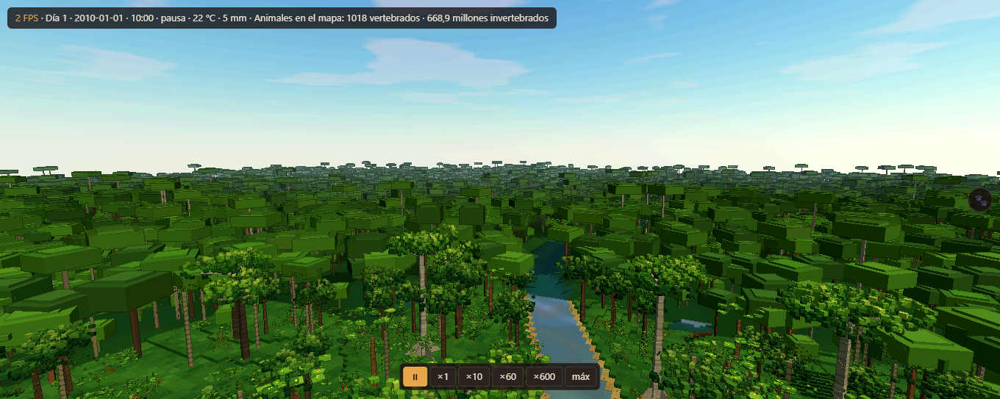
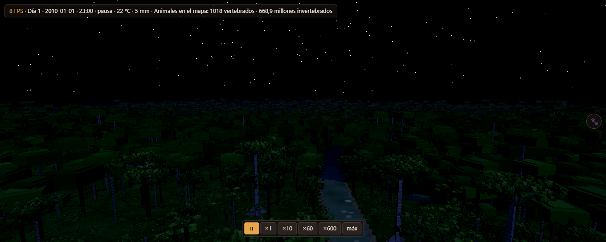
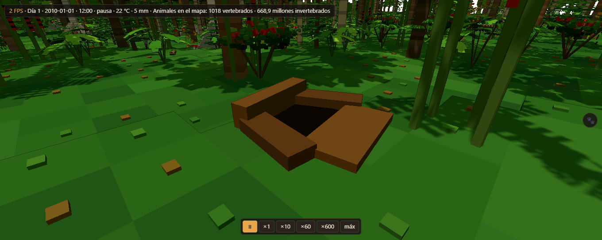
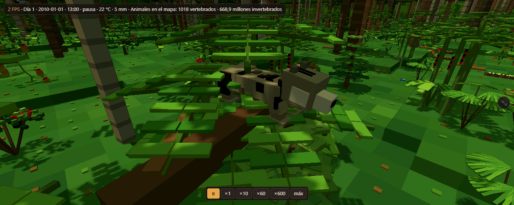
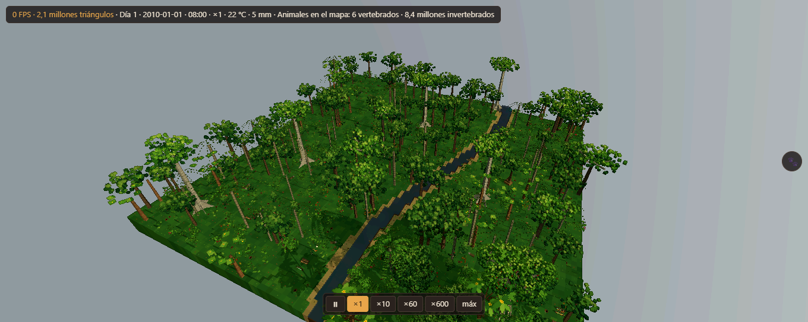

# Informe: Virtual Ecosystem en JavaScript, comparado bit a bit con el original

Fecha: 2026-10-02 · Original: Virtual Ecosystem v0.2.2, commit `0176dc2` · Máquina de
referencia: Windows 11, Ryzen 9 5900X, Python 3.12.4, numpy 2.5.3, scipy 1.18.1,
pyrealm 3.0.0rc4 · Node 22.22.1.

## Resumen

**Todo lo comparado sale idéntico bit a bit**: cada variable del zarr en cada paso (grupos
`inputs`, `init` y `outputs`, las 131 salidas incluidas), los CSV de animales (cohortes,
interacciones tróficas y pools) y los CSV de plantas, en todas las configuraciones probadas.
No queda ninguna diferencia que explicar: donde las había (funciones matemáticas, orden de
las sumas, integrador del suelo, azar...) se ha replicado la operación del original hasta
quitarla.

| Caso | Qué cambia | Zarr | CSV | Python | JS |
|---|---|---|---|---|---|
| mensual | el ejemplo: 9×9 celdas, 2 años, paso mensual | 249/249 idénticas | 3/3 idénticos | 138 s | 20 s |
| simple | `abiotic_simple` en vez de `abiotic` | 234/234 idénticas | 3/3 idénticos | 145 s | 9 s |
| bio | otros animales y plantas (ver abajo) + exportador de plantas | 249/249 idénticas | 6/6 idénticos | 167 s | 30 s |
| clima | +3 °C, −40 % lluvia, otra humedad, viento, CO₂ y radiación | 249/249 idénticas | 3/3 idénticos | 132 s | 28 s |
| rejilla | rejilla de 6×4 celdas | 249/249 idénticas | 3/3 idénticos | 103 s | 9 s |
| diario | el ejemplo a paso diario, clima diario (731 pasos) | 249/249 idénticas | 2/2 idénticos¹ | 4 h 22 min | 28 min |
| navegador | el ejemplo corrido en la interfaz (Chrome, Web Worker) y exportado desde ella | 249/249 idénticas | 3/3 idénticos | | ~1 s/paso |

¹ A paso diario ningún animal come (ver el fallo de los herbívoros), así que ninguno de los
dos escribe `animal_trophic_interactions.csv`.

Los tiempos son de la simulación completa (sin la lectura de datos de Python); varias
pasadas corrían a la vez en la máquina, así que son orientativos. El JS va entre **5 y 15
veces más rápido** que el original. Detalle por caso en `runs/cmp_<caso>.md` y en
`informe/suite.json`.

Además, durante la portación cada módulo se comparó por separado (sustituyendo los demás
con los datos del original) tras su `init` y tras cada actualización, y en el de animales
también el estado interno completo (cada cohorte, comunidades, charcos de cadáveres y
excrementos, registro trófico): todo idéntico en los 24 pasos.

### Qué cambia en cada variante

- **bio**: grupos funcionales con otras masas adultas y al nacer, otras dietas
  (`vertebrates_invertebrates`, `foliage_fruit_seeds`, `mushrooms_fungi`), lombriz solo en
  el suelo, ventana térmica explícita para la rana, densidad de partida fijada para un
  insecto; constantes `density_scaling_method = 'damuth'`, `thermal_habitat_selection =
  false` (la dispersión pasa a usar `random.choice` de Python), `tau_f`, `u_bg`; PFT con
  otra alometría (`m = 3`, `n = 4`, `h_max`, `lai`, `sla`...), otras cohortes de partida y
  otras constantes de plantas (mortalidad, reclutamiento, rebrote); exportador de plantas
  activado con listas parciales de columnas (cuyo orden sale de un `set` de Python).
- **clima**: los `.nc` de clima y radiación transformados.
- **rejilla**: el bloque inferior izquierdo de 6×4 celdas de los datos.
- **diario**: ver la sección siguiente.

## El ejemplo a paso diario

El original **no puede correr el ejemplo tal cual a paso diario**: los datos de clima y de
radiación traen 24 valores (uno por mes) y en el paso 24 falla con
`IndexError: index 24 is out of bounds for axis 1 with size 24`. El motor JS da el mismo
error en el mismo sitio. Para la prueba diaria se ha creado la variante
`datos/variantes/diario`, que repite el valor de cada mes en sus días (731 pasos: 2 años de
365,25 días).

Resultado: **idéntico bit a bit** en los 731 pasos (las 249 variables del zarr y los CSV de
cohortes y pools). El original tarda 4 h 22 min (unos 21 s por paso) y el motor JS 28 min
(2,3 s por paso). En ambos casi todo el tiempo se va en el modelo de animales: a diario casi
no muere ninguna cohorte (siguen vivas las 1.620 del principio) y cada una busca presas en
su territorio en cada paso.

## Cómo se ha conseguido que coincida bit a bit

Que dos programas den los mismos bits exige que cada operación en coma flotante se haga
igual y en el mismo orden. Lo que ha hecho falta replicar:

- **Funciones matemáticas**: numpy y `math` de Python usan aquí la UCRT de Windows
  (`ucrtbase.dll`), cuya ruta con FMA no coincide con la de V8 (el `Math.exp` de JS difiere
  en ~7 % de los casos). `exp`, `log`, `log10`, `log1p`, `pow`, `sin`, `cos` y `asin` se han
  traducido instrucción a instrucción del desensamblado de la DLL, con sus tablas, y un
  `fma` correctamente redondeado. Probadas contra millones de valores sin una sola diferencia
  (`pruebas/numerica.test.js`).
- **Sumas de numpy**: la suma por pares con 8 acumuladores y bloques de 128, las
  reducciones por ejes (secuencial en el eje 0, por pares en el último), `nansum`,
  `nanmean`, `cumsum`.
- **Álgebra lineal**: `np.dot` y los productos matriz-vector van por OpenBLAS (`ddot` con 16
  acumuladores y FMA, `dgemv` por bloques de 4 columnas); se han replicado sus caminos.
- **Potencias**: `ndarray ** escalar` usa atajos para −1, 0, ½, 1 y 2 (`x*x`, `sqrt`...);
  `float ** float` y `np.float64 ** n` van a `pow` de la UCRT.
- **Python**: `sum()` de 3.12 usa suma compensada de Neumaier solo mientras los sumandos son
  `float` de Python, y pasa a suma simple al encontrar un `np.float64`; en los animales los
  valores pasan de un tipo a otro según qué hayan comido, así que el motor lleva la cuenta del
  tipo de cada masa. `statistics.mean` (exacta en racionales), `round` al par, `min`/`max`
  de Python con NaN, `'%0.5f' %` (redondeo correcto con empates al par).
- **Integrador del suelo**: `solve_ivp` RK45 de scipy con sus mismos pasos adaptativos
  (paso inicial, norma de error, factores de seguridad).
- **pyrealm**: P-model, T-model, perfiles de copa y alturas de las capas del dosel con el
  `brentq` de scipy traducido de su C.
- **Azar**: MT19937 de `random` y del `RandomState` legacy de numpy (con su `gauss` en
  caché, binomial por inversión/BTPE, `choice`, `permutation`), y `default_rng` (SeedSequence,
  PCG64, ziggurat, gamma de Marsaglia–Tsang), en el mismo orden de uso.
- **Orden de los `set`**: el orden de iteración de los `set` de CPython (tabla hash, sondeo,
  hash de enteros y SipHash de cadenas) importa en el drenaje de la hidrología, en el orden
  de los módulos y en el de las presas; se ha replicado.
- **Fechas y unidades**: pint toma el mes como 30,4375 días; numpy trunca los `timedelta64`
  al multiplicarlos por decimales.

### Lo que el original no hace determinista (y cómo se ha fijado)

El original, tal cual, no da dos veces el mismo resultado. `herramientas/oraculo.py` lo
envuelve sin tocar su código y fija esas fuentes de una forma que el motor JS reproduce:

- `random` y `np.random` se siembran con la semilla de la pasada.
- La hidrología llama a `np.random.default_rng()` sin semilla en cada paso: pasa a
  `default_rng([semilla, k])` con k = 0, 1, 2...
- Los ids de las cohortes de animales (`uuid4`) pasan a ser `UUID(int=k, version=4)`.
- El orden del `set` de presas dependía de la dirección de memoria de cada cohorte
  (`id()`); pasa a ser su número de creación.
- Con `abiotic_simple` el orden de los módulos depende de la semilla de hash de Python; se
  usa `PYTHONHASHSEED=0`.

La semilla se puede cambiar en la interfaz y en la línea de órdenes; con la misma semilla y
la misma entrada, el resultado es siempre el mismo.

### Ámbito de la coincidencia

Los bits replicados son los de esta máquina de referencia (Windows, UCRT, CPU con FMA). El
propio original da otros bits en Linux o macOS (otra `libm`) o en una CPU sin FMA (la UCRT
toma otro camino): ahí el motor JS seguiría dando los bits de la referencia, no los de esa
máquina. Fuera de los casos de error, el comportamiento es el mismo; en los casos en que
Python lanzaría una excepción (división de un `float` entre cero, `exp` desbordado,
`sin`/`cos` de argumentos mayores que 2·10⁷), el motor JS sigue con NaN/infinito o lanza su
propio error.

## El fallo conocido de los herbívoros (portado tal cual)

Se ha portado sin arreglar, como pedía el encargo. Mirando el código, salen estas causas, que
sirven para el encargo de arreglarlo:

1. **El tiempo de forrajeo se trunca a días enteros.** `dt * tau_f * sigma_f_t /
   n_dietas` se calcula con `timedelta64` de numpy, que trunca: con paso mensual (30 días
   ×0,5) quedan 15 días repartidos entre las dietas (5 días para un herbívoro de 3 dietas,
   3 para la lombriz); **con paso diario quedan 0 días y ningún animal come nunca**.
2. **El metabolismo es cero.** `metabolic_rate` usa la constante de Boltzmann del core en
   J/K (1,38·10⁻²³) en una fórmula que la espera en eV/K: `exp(−Ea/(kB·T))` vale 0. La
   respiración animal total es exactamente 0 en todas las pasadas.
3. **Nadie se reproduce.** La masa reproductiva nunca aumenta en ningún sitio del código, así
   que el número de crías es siempre 0.
4. **Comparaciones de un `Enum` con un texto**: `reproductive_type == 'semelparous'` y
   `migration_type == 'seasonal'` nunca son ciertas, así que no hay migración estacional ni
   muerte tras la reproducción semélpara.
5. Las tasas de búsqueda y manejo de herbívoros (`alpha_0_herb = 1e-11`) dan consumos
   ínfimos: en la pasada mensual, lo consumido del follaje del dosel es del orden de 0,005 %
   de lo disponible al mes.

Arreglado en el encargo 2 (abajo, A1): son correcciones opcionales, apagadas por defecto.

## Qué no se ha comprobado

- La rejilla **hexagonal** no se puede comparar: el original no la admite (la hidrología
  falla con `This grid type is currently not supported!` al construir el mapa de drenaje).
  El motor JS da el mismo error en el mismo sitio. Las pruebas usan rejillas cuadradas.
- La hidrología admite solo dos capas de suelo, como el original.
- La interfaz se ha probado en Chrome: arrancar, paso a paso, correr, velocidad, gráficas,
  mapa, explorador, editores de parámetros, tablas y entradas, guardar y cargar
  configuración (la semilla y los parámetros cargados se aplican), y las cuatro
  exportaciones. El zarr y los CSV exportados desde la página son idénticos al original.

## Cuánto ocupa

Motor ~7.200 líneas de JS (sin dependencias); interfaz, herramientas y pruebas ~2.700.

---

# Encargo 2: el mundo vivo de Maliau

Fecha: 2026-10-03. Todo lo de este encargo va **encima** del motor y no cambia sus bits:
las correcciones están apagadas por defecto y `node --test pruebas/motor.test.js` (huellas
del ejemplo frente al original) sigue pasando.

## A1. El fallo de los herbívoros: causas y arreglo

A paso diario no comía nadie y todo se moría. No era una sola cosa: arreglada una, aparecía
la siguiente. Cada causa es una corrección con su interruptor (`CORRECCIONES_ANIMAL` en
`motor/modelos/animal.js`, y `CORRECCIONES_PLANTAS/HIDROLOGIA/SUELO/HOJARASCA` en
`motor/correcciones.js`). `activarCorrecciones(escenario)` las enciende todas, y la casilla
**corregir el fallo de los herbívoros** de la interfaz hace lo mismo. Apagadas, el motor es
el original bit a bit.

| Corrección | Qué hace mal el original | Efecto |
|---|---|---|
| `forrajeo_continuo` | el tiempo de forrajeo se pasa por `timedelta64` y se trunca a días enteros: a paso diario sale **0 días** | **la causa de que a diario no coma nadie** |
| `sotobosque_por_m2` | la vegetación y las semillas del sotobosque vienen en kg/m² y se tratan como kg por celda (8100 m²); como el encuentro va con la densidad al cuadrado, se comía ~6,5·10⁷ veces menos | herbívoros del sotobosque (insectos, lagartos) |
| `boltzmann_ev` | el metabolismo usa la constante de Boltzmann del core en J/K donde la fórmula la espera en eV/K: `exp(−E/kT)` = 0 | sin esta, los animales no gastan nada |
| `metabolismo_una_vez` | cada cohorte metaboliza una vez **por celda de su territorio** (×81 en uno grande) | con la anterior arreglada, morían de hambre en días |
| `metabolismo_con_comida` | el metabolismo se paga solo con el carbono del cuerpo y la relación C:N se deriva | lo sobrante de lo comido paga primero |
| `reproduccion` | la masa reproductiva no aumenta en ningún sitio del código | sin crías nunca |
| `comparar_enums` | un `Enum` comparado con un texto nunca es igual: sin semélparos, migración estacional ni no reproductores | |
| `agotar_recursos` | lo que come una cohorte sigue disponible para las siguientes del mismo paso | se come como mucho la mitad de lo que queda, y sin 0/0 |
| `tiempo_plantas`, `tiempo_presas` | el tiempo se divide entre todas las dietas aunque todas las categorías vegetales (o de presa) se comen en la misma llamada | 1/n de lo que toca |
| `caza_redondeo` | `ceil` mata un individuo entero por un bocado de presa | redondeo al azar con la misma media |
| `caza_lineal` | el encuentro con presas va con la densidad **al cuadrado** | |
| `setas` | los fungívoros nunca encuentran las setas | |
| `damuth_log10` | la ley de Damuth usa el término independiente sin log10 | densidades absurdas al crear cohortes |
| `presas_pequenas` | no se pueden cazar presas de menos de 0,1 g (termitas, insectos jóvenes) | |
| plantas `restar_sotobosque` | lo comido del sotobosque no se resta de su biomasa | comida infinita |
| hidrología `lluvia_paso_diario` | a paso diario la lluvia se reparte con una cadena de Markov cuyo primer estado usa `p_wet_dry`: se pierde la lluvia el 70 % de los días | el suelo se secaba y la hojarasca daba NaN |
| hidrología `evaporacion_suelo` | usa la presión de saturación en kPa en vez de la humedad específica, y divide un flujo de masa por el calor latente | |
| hojarasca `tasa_cero` | con tasa de descomposición 0 divide 0/0 → NaN | |
| suelo `setas_por_m2` | resta kg de setas comidas de un pool en kg/m² | cuerpos fructíferos negativos |
| `cohortes_iniciales_mezcladas` | las cohortes del principio se crean todas con la masa de **recién nacido** (4–10 % de la adulta), aunque su número se calcula como si fueran adultos | casi nadie llegaba a adulto para criar; ahora tienen masas de cría a adulto |
| `metamorfosis_solo_larvas` | toda cohorte de desarrollo indirecto se metamorfosea al llegar a su masa adulta, **también los adultos**: la mariposa adulta se vuelve oruga | las mariposas no criaban nunca |
| `fusionar_cohortes` | cada nacimiento crea una cohorte y nunca se juntan: su número crece sin parar | si un grupo pasa de 60 cohortes, se juntan las de la misma celda con masa parecida (como Madingley) |
| `inmigracion` | cada celda es una isla: no entra ni sale nadie | ver A3 |

Además, cuatro **ajustes de parámetros** (`AJUSTES`) que con lo anterior arreglado no tienen
sentido: eficiencia de asimilación (0,5 herbívoros, 0,8 carnívoros, 0,65 omnívoros, de
Madingley; el original pone 0,1/0,25, que es la eficiencia entre niveles tróficos y, con el
metabolismo aparte, cuenta la respiración dos veces), composición C:N:P de los cuerpos
(80/17/3; el original pone 50/30/20 en mamíferos), la tolerancia al tamaño de la presa y el
umbral de cría (`birth_mass_threshold` 1,1: un adulto cría cuando ha juntado un 10 % de su
peso; el original pide la mitad de su peso y suelta 12 polluelos de un ave de 1 kg).

**La tasa de búsqueda**: con todo lo anterior, las fórmulas de encuentro siguen dando
consumos que no casan con animales reales (unos grupos no comen y otros arrasan). Para
Maliau se ha añadido una columna opcional `search_rate_multiplier` en la tabla de grupos
(1 = original) y `herramientas/calibrar_busqueda.mjs` la ajusta para que cada grupo asimile
≈1,5 veces lo que gasta (`datos/calibracion/maliau.json`). **Es lo más dudoso de todo**: los
multiplicadores van de 4·10⁻⁶ (termitas) a 5·10⁵ (carroñeros), lo que dice que la forma de
la fórmula (encuentros con la densidad en individuos por hectárea, manejo por gramo) no
escala con densidades y masas reales; habría que revisarla, no solo calibrarla.

## A2. Clima diario real de Maliau

`herramientas/clima_maliau.py` baja de Open-Meteo (sin cuenta) los históricos diarios de
2010 a 2020 en 4,83 N, 116,90 E: ERA5-Land (temperatura media/máx/mín, punto de rocío,
humedad) y ERA5 (lluvia, radiación solar, presión, nubes, viento). La radiación de onda
larga no viene en ninguno y se calcula (Brutsaert 1975 con la nubosidad de Crawford y Duchon
1999); el CO₂ es la media anual de Mauna Loa. Son 4018 días; todas las celdas reciben el
mismo clima, como hace el guion de Maliau del propio Virtual Ecosystem.

El escenario `maliau` cambia además las dos tablas del ejemplo, que es un bosque de juguete:
los 20 grupos de animales con la masa de su especie de Maliau y una **densidad realista**
(`ANIMALES_MALIAU`), y un bosque de dipterocarpos con su estructura por diámetros (por celda:
200 troncos de 12 cm, 60 de 25, 14 de 50, 3 de 90 y 600 arbustos). Usa `abiotic_simple`: el
`abiotic` completo diverge con un dosel tan cerrado (LAI > 5 en una sola capa da noches de
−32 °C). El eslizón «termófilo» del ejemplo tiene el óptimo a 35 °C y en Maliau no estaría
nunca activo: se le pone 28 °C (rango 18–38).

Velocidad del motor con Maliau a paso diario: 0,12–0,22 s por día.

## A3. ¿Se sostiene?

Tres años a paso diario (`node herramientas/sostenibilidad.mjs --dias 1096`, motor solo,
9×9 celdas de 90 m = 0,66 km²). Individuos activos en la rejilla al empezar, al cumplir cada
año y al acabar; y en los tres años, cuántos nacen (las ranas, al salir del agua), cuántos
pasan de larva a adulto (oruga → mariposa...), cuántos entran del bosque de alrededor, cuántos
mueren, cuántos son cazados, cuántos se van y la migración estacional (golondrinas):

| grupo | al empezar | año 1 | año 2 | año 3 | al acabar | nacen | por metamorfosis | entran | mueren | cazados | se van | migración estacional (neta) | entran / (nacen + metamorfosis + entran) | sin cuadrar¹ |
|---|---:|---:|---:|---:|---:|---:|---:|---:|---:|---:|---:|---:|---:|---:|
| carnivorous_bird | 14.0 | 37.0 | 46.0 | 42.0 | 41.0 | 1398 | 0.0 | 0.0 | 65.0 | 606 | 700 | 0.0 | 0 % | 0.0 |
| herbivorous_bird | 66.0 | 20.0 | 20.0 | 20.0 | 20.0 | 42.0 | 0.0 | 222 | 110 | 200 | 0.0 | 0.0 | 84 % | 0.0 |
| carnivorous_mammal | 1.0 | 0.0 | 0.0 | 0.0 | 0.0 | 0.0 | 0.0 | 0.0 | 0.0 | 0.0 | 1.0 | 0.0 | — | 0.0 |
| herbivorous_mammal | 10.0 | 4.0 | 3.0 | 2.0 | 2.0 | 0.0 | 0.0 | 15.0 | 17.0 | 6.0 | 0.0 | 0.0 | 100 % | 0.0 |
| carnivorous_insect_iteroparous | 13.122 | 7427 | 6263 | 5579 | 5676 | 112.012 | 0.0 | 11.499 | 125.480 | 5477 | 0.0 | 0.0 | 9 % | 0.0 |
| herbivorous_insect_iteroparous | 328.050 | 167.506 | 130.084 | 117.096 | 117.036 | 168.764 | 0.0 | 395.186 | 615.504 | 159.460 | 0.0 | 0.0 | 70 % | 0.0 |
| carnivorous_insect_semelparous | 3281 | 909 | 1601 | 3611 | 3415 | 89.025 | 0.0 | 3561 | 89.443 | 1355 | 911 | 0.0 | 4 % | 743 |
| herbivorous_insect_semelparous | 13.122 | 21.454 | 11.084 | 5442 | 5431 | 30.379 | 0.0 | 1509 | 27.285 | 9779 | 2480 | 0.0 | 5 % | 35.0 |
| butterfly | 13.122 | 4623 | 4545 | 4268 | 4265 | 0.0 | 0.0 | 36.213 | 27.759 | 15.385 | 0.0 | 0.0 | 100 % | 1926 |
| caterpillar | 32.805 | 10.110 | 9719 | 8975 | 8963 | 6547 | 0.0 | 109.234 | 115.190 | 24.433 | 0.0 | 0.0 | 94 % | 0.0 |
| frog | 329 | 681 | 1409 | 1192 | 1167 | 7506 | 0.0 | 310 | 756 | 1852 | 4605 | 0.0 | 4 % | 235 |
| swallow | 33.0 | 24.0 | 58.0 | 82.0 | 84.0 | 3670 | 0.0 | 30.0 | 2855 | 243 | 168 | -393.0 | 1 % | 10.0 |
| earthworm | 13.122.000 | 4.468.717 | 4.636.235 | 4.373.033 | 4.359.140 | 2.032.340 | 0.0 | 33.631.647 | 43.347.133 | 1.079.714 | 0.0 | 0.0 | 94 % | 0.0 |
| dung_beetle | 131.220 | 350.344 | 374.902 | 377.927 | 375.657 | 6.715.612 | 0.0 | 0.0 | 704.234 | 24.451 | 5.742.490 | 0.0 | 0 % | 0.0 |
| scavenging_mammal | 6.0 | 3.0 | 1.0 | 3.0 | 3.0 | 347 | 0.0 | 4.0 | 12.0 | 132 | 210 | 0.0 | 1 % | 0.0 |
| detritivorous_insect | 656.100.000 | 242.765.572 | 214.813.106 | 202.447.097 | 201.329.047 | 824.764.489 | 0.0 | 1.829.298.631 | 3.106.059.356 | 2.774.717 | 0.0 | 0.0 | 69 % | 0.0 |
| fungivorous_mammal | 4.0 | 2.0 | 2.0 | 1.0 | 1.0 | 9.0 | 0.0 | 3.0 | 7.0 | 4.0 | 4.0 | 0.0 | 25 % | 0.0 |
| herbivorous_lizard | 197 | 57.0 | 48.0 | 48.0 | 49.0 | 0.0 | 0.0 | 899 | 235 | 812 | 0.0 | 0.0 | 100 % | 0.0 |
| carnivorous_snake | 33.0 | 20.0 | 12.0 | 33.0 | 32.0 | 232 | 0.0 | 52.0 | 40.0 | 245 | 0.0 | 0.0 | 18 % | 0.0 |
| thermophilic_lizard | 329 | 98.0 | 86.0 | 93.0 | 94.0 | 20.0 | 0.0 | 1246 | 471 | 1030 | 0.0 | 0.0 | 98 % | 0.0 |
¹ semélparos que mueren al criar: el motor no apunta ese suceso

Motor solo: 191 s para los 3 años (0,17 s por día).

- **No se extingue nadie ni explota nada** en tres años, salvo la pantera nebulosa: hay 1 al
  empezar y se va en el primer año (en 0,66 km² tocarían 0,013; es lo realista).
- El primer año casi todos bajan a un 30–40 % de la densidad de partida (que era la de
  referencia de la literatura) y **los años 2 y 3 se quedan estables**.
- **Se sostienen solos** (menos del 10 % de lo que se repone viene de fuera): rapaces,
  insectos cazadores, ranas, golondrinas (con su migración), peloteros, carroñeros y
  serpientes. Las rapaces crían de sobra y una parte se va a otras zonas.
- **Dependen del bosque de alrededor**: aves y mamíferos herbívoros (84–100 % de lo que entra
  viene de fuera), insectos herbívoros iteróparos (70 %), lombrices (94 %), termitas (69 %),
  mariposas (las orugas tendrían que multiplicar su masa por 200 para metamorfosearse y casi
  ninguna llega) y, sobre todo, los **lagartos**: crían poco o nada y los cazan mucho (812 y
  1030 cazados en tres años). Es decir, la celda funciona como un sumidero que se mantiene
  con lo que llega de fuera: realista para 0,66 km² de bosque continuo, pero dice que la
  cría de los herbívoros del motor sigue siendo baja.
- Lo que hizo falta, además de las correcciones de A1: la entrada y salida de animales con
  el bosque de alrededor (`inmigracion`: si un grupo baja de la mitad de su densidad de
  referencia, entran casi adultos por el borde, como mucho lo que falta en 60 días; si pasa
  del doble, se van en 15 días), poblaciones iniciales con edades mezcladas, que solo las
  larvas se metamorfoseen, un umbral de cría realista y fusionar cohortes (sin esto, el
  número de cohortes crece con cada nacimiento: 3471 el día 400 y el motor pasaba de
  0,1 a 0,45 s por día; con la fusión se queda en ~700 y 0,11 s).

## B. La capa de individuos (`mundo/`)

Sin nada de gráficos, en Node y en un Worker. **Determinista**: azar propio (sfc32, con la
semilla, el día y el intento), paso fijo de un minuto de juego (1440 tics por día) e
identificadores reiniciables; la prueba automática repite dos días y compara las huellas.

- `puente.js`: avanza el motor un día y entrega las cohortes de antes y después, los sucesos
  (cazas con su masa, muertes, nacimientos, metamorfosis, dispersiones, entradas y salidas),
  el clima, el bosque de la celda del diorama y lo que comió allí cada cohorte. Para esto el
  motor apunta sus sucesos si se le pide (`registrarEventos`), sin cambiar nada más.
- `mapa.js`: toda la rejilla del motor en metros (1 unidad = 1 m), con el arroyo, charcas,
  relieve y, en el diorama, **cada árbol de las cohortes del motor** (mismo número, diámetro,
  altura y copa; la especie de dibujo según el tipo y el diámetro), con la fruta, la fruta
  caída y las hojas que da el motor repartidas por copas (las higueras dan seis veces más
  fruta por copa) y las setas según los cuerpos fructíferos del motor (una mata por cada
  2,5 g/m², hasta 120, cada una en su sitio fijo).
- `especies.js`: las 33 especies del Observer con su comportamiento: cómo se mueven,
  velocidad al andar y al correr, alcance de la vista, horario (diurno, nocturno,
  crepuscular, catemeral), qué comen y dónde, cómo cazan (acecho, emboscada, lengua, picada,
  al vuelo, persecución) y con qué éxito, alerta, refugio, hogar (madriguera, nido, dormidero,
  cama, termitero), si van en grupo, si beben y cuándo crían.
- `agentes.js` y `dia.js`: cada bicho tiene posición, rumbo, altura, hambre, sed, sueño,
  masa, edad, sexo, hogar, territorio (las celdas de su cohorte) y lo que ve (radio de
  vista). Cada minuto decide (máquina de estados con prioridades): huir si un depredador se
  le acerca; dormir fuera de su horario (volviendo antes a su hogar y arreglando la
  madriguera o el nido); beber en la orilla o la charca más cercana si tiene sed; comer
  **donde hay comida de verdad** (fruta en las copas, fruta caída y semillas bajo los
  árboles, hojas, sotobosque, hojarasca, setas, carroña, excrementos, otros bichos);
  cortejar en su época a uno de su especie y del otro sexo, y aparearse; excavar
  (madrigueras, lombrices, peloteros); anidar en época de cría; descansar si está cansado;
  seguir a su grupo o pasear por su territorio. Los que andan nadan al cruzar agua; los
  insectos se dan la vuelta en la orilla. La caza: buscar una presa de su tamaño (entre
  10⁻⁵ y la mitad de su masa) de los grupos que el motor le da como presa, acecharla, carrera
  si la presa se da cuenta y ataque con su éxito; a veces falla y la presa huye.
- Cerca del diorama (±25 m) se simula cada minuto; fuera, cada 10 minutos (también se caza
  ahí, con una rejilla gruesa). Se graba la línea de tiempo (x, altura, z, rumbo, estado y
  qué come) de lo que pasa en el diorama ±4 m.

**Escala y representantes.** 1 unidad = 1 m; el diorama es la celda central del motor
(90 × 90 m). Los vertebrados son individuos uno a uno en toda la rejilla (~1000 al empezar:
cada uno, un individuo de una cohorte del motor, con su masa y su edad). Los invertebrados
son millones y van con **representantes en el diorama**, cada uno por N individuos del motor
(N fijo por grupo, redondeado, para que haya unos 20–50 de cada uno):

| Grupo | N |
|---|---:|
| carnivorous_insect_iteroparous | 10 |
| carnivorous_insect_semelparous | 2 |
| herbivorous_insect_iteroparous | 500 |
| herbivorous_insect_semelparous | 10 |
| caterpillar | 50 |
| butterfly | 10 |
| earthworm | 10 000 |
| dung_beetle | 100 |
| detritivorous_insect (termitas) | 500 000 |

Lo que hay de cada grupo en la celda según el motor salta mucho de un día a otro (los
territorios de las cohortes entran y salen de ella), así que el número de representantes
sigue una media móvil (20 % al día); los que faltan llegan por el borde (las lombrices y
orugas salen del suelo) y los que sobran se van andando.

## C. Que cuadre con el motor, cada día

Cada día (`mundo.js`):
1. el motor avanza y sus sucesos pasan a objetivos: qué individuos mueren cazados y por qué
   grupo, cuáles de muerte natural (a una hora al azar), quiénes nacen (junto a su madre),
   llegan o se van;
2. se simula el día con varias **semillas** sin ayuda y se elige la que más se parece;
3. el **director** repite tal cual lo que salió solo en esa semilla, protege a las presas de
   las cazas que sobran (se escapan) y condena a las que faltan (el cazador va a por ella y
   no falla); hasta dos pasadas;
4. lo que aún falta se cierra: si pasa fuera de la vista, la presa muere sin verse; si pasa
   a la vista, al final del día;
5. una caza que sale sola **vale si coincide en grupo**: presa del grupo que dice el motor
   comida por un cazador del grupo que dice el motor. Entonces las dos presas intercambian su
   identidad de cohorte (masa, edad, territorio), que a la vista son iguales;
6. las cazas de sobra que no se pudieron evitar se deshacen; si la presa se veía, su línea de
   tiempo se reescribe como una huida en el último momento (no muere y resucita);
7. al acabar, cada cohorte de vertebrados tiene exactamente los individuos del motor.

Además, dos comportamientos se **ajustan solos** (el mecanismo 1, «ajustar los
comportamientos para que de media se parezca»): la *cacería* (probabilidad de que un
depredador con hambre vaya a por vertebrados en vez de invertebrados), para que salgan tantas
cazas como en el motor, y el *bocado* por clase de comida, para que lo comido en el diorama
sea lo que apunta el motor.

**Cuánto hace falta cada cosa** (`node herramientas/mundo_mecanismos.mjs --dias 30`, cazas
de vertebrados del motor en 30 días de Maliau):

| Configuración | Cazas del motor | Salen solas | Las empuja el director | Se cierran fuera de vista | Al final, a la vista | Cazas de sobra evitadas | Deshechas (a la vista) | s/día |
|---|---:|---:|---:|---:|---:|---:|---:|---:|
| Solo comportamientos (1 semilla) | 171 | 47 % | — | 53 % | 1 % | — | 151 (0) | 0,39 |
| 4 semillas, sin director | 171 | 56 % | — | 44 % | 1 % | — | 119 (0) | 1,17 |
| 4 semillas + director (lo normal) | 171 | 59 % | 33 % | 9 % | 0 % | 257 | 136 (0) | 1,54 |

Es decir: los comportamientos solos ya dan casi la mitad de las cazas (del grupo correcto, el
día correcto); las semillas suben un 10 %; el director añade un tercio, y menos de una
décima parte se resuelve fuera de la vista (lejos del diorama, donde el cazador no llega a
la presa en el día). Ninguna caza de sobra deshecha cae a la vista. Los ajustes de
recuento al acabar el día fueron 2 en 30 días.

Lo demás que se mide cada día (sale en el panel de resumen de la página):
- **Recuento por cohorte**: idéntico al motor todos los días; los ajustes de recuento al
  acabar el día (bichos que hay que quitar o poner a mano) son 0 casi siempre (2 en 30 días).
- **Masa cazada** (5 días, toda la rejilla): motor 1037 g, mundo 1146 g. La diferencia es de
  las cazas emparejadas por grupo, que intercambian la presa por otra del mismo grupo.
- **Lo comido en el diorama** (días 2 a 5, motor · mundo): plantas 216 g · 209 g, hojarasca
  10,0 kg · 7,6 kg, setas 54 g · 75 g. La carroña y los excrementos (2 g y 0,8 g en el
  motor) casi no se comen en el diorama: los carroñeros y peloteros que salen ahí no los
  encuentran a tiempo.
- **Plantas**: los árboles del diorama son los de las cohortes del motor cada día (nacen y
  mueren cuando el motor lo dice), y la fruta, las hojas y las setas, las suyas.
- **Nacimientos**: solo cuando el motor los da (casi nunca en un día). El cortejo y el
  apareamiento son comportamiento (cada adulto, una vez cada día y medio de actividad en su
  época); la cría la decide el motor.

**Pruebas automáticas** (`pruebas/mundo.test.js`, 6 pruebas, ~10 s): determinismo; cada
cohorte con los individuos del motor cada día y casi sin ajustes; todas las cazas del motor
pasan; los representantes siguen a la celda; la línea de tiempo se puede dibujar (dentro,
estados válidos, sin saltos de más de lo que corre el más rápido); lo cazado y lo comido se
parecen al motor.

## D. La parte visual (`vivo/`)

`node interfaz/servidor.mjs` y abrir <http://localhost:8090/vivo/> (teclas en el README).

- El diorama con los modelos y el estilo de `graficos/pruebas-morta/` (escena v3): el
  terreno sale del mapa del mundo (mismo arroyo y relieve, en escalones de 0,5 m); cada árbol
  del motor, con el modelo de su especie a una escala según la altura que le da el motor
  (raíz cuadrada, entre ×0,45 y ×1,7, para que los gigantes de 40 m no rompan el diorama);
  troncos caídos, el termitero y las setas del día.
- **Cada estado con su animación**. Las de los esqueletos del Observer (quieto, andar,
  correr, comer, atacar, dormir, morir, volar, planear, reptar, saltar...) y, para los
  estados que faltaban, una animación base a otro ritmo con un retoque encima
  (`vivo/animaciones.js`): **beber** (cabeza abajo, sorbos), **acechar** (agachado, despacio),
  **huir** (carrera a saltos), **cortejar** (giros y botes), **aparearse**, **excavar** (morro
  abajo, hundiéndose), **anidar** (vueltas en el sitio), **nadar** (medio hundido,
  meciéndose), **trepar** (de pie contra el tronco) y **nacer** (crece). Los ficheros del
  Observer no se han tocado.
- **Día y noche** por la hora del juego (amanece a las 6:10 y anochece a las 18:15, como a
  4,8° N), con el sol cruzando de este a oeste y las luces del Observer mezcladas en el alba
  y el ocaso. De noche, luciérnagas y las **setas luminosas brillando** con un halo. Los días
  de más de 5 mm, aguacero por la tarde.
- **Velocidades**: pausa, ×1 (1 día = 24 min), ×10, ×60, ×600 y máx. **Modo resumen** a partir
  de ×60 (o con Z): un panel con lo que dijo el motor y lo que se ha conseguido (cazas solas,
  empujadas, masa, comida, nacimientos...) y lo que va pasando. Las animaciones siguen.
- **El día siguiente se calcula antes de enseñarlo**, en un Worker que va dos días por
  delante; a más velocidad se esfuerza menos (×600: 2 semillas y 1 pasada del director; máx:
  1 y 1).
- Cámara de Unity, pantalla completa (Intro), indicador mínimo de día, fecha, hora,
  velocidad, temperatura y lluvia (I lo oculta), controles (C) y **seguir a un bicho** (G).

**Velocidad y fotogramas** (Chrome, RTX 3090, Ryzen 9 5900X):

| | |
|---|---|
| Cálculo de un día (motor + bichos), normal: 4 semillas + director | 1,8 s (1,5 de media en 30 días) |
| ×600 (2 semillas, 1 pasada) | 1,3–1,7 s (un día dura 2,4 s): 0 esperas en 25 s de prueba |
| máx (1 semilla) | ~1,0 s por día → **1 día por segundo** (≈ ×1440) |
| Cuadro, vista general (342 000 cubos de plantas, ~200 bichos) | 15–16 ms (**60–65 FPS**), igual a 1360×543 que a 1920×1080 |
| Cuadro, a ras de suelo entre ~100 bichos | 15 ms a 1920×1080 |
| Cambio de día | 20–110 ms (bichos nuevos y el trozo de bosque donde nace o muere un árbol) |

La pestaña de Chrome que se usó para medir estaba en segundo plano (sin fotogramas), así
que los tiempos son de pintar cuadros seguidos esperando a la GPU en cada uno
(`__vivo.medirCuadros()` en la consola): lo que costaría cada cuadro con la pestaña delante.
En el primer montaje iba a 12 FPS; lo que lo arregló: fundir las piezas de cada articulación
de los modelos en una malla (de 7858 mallas a 3879), no pintar los bichos que a esa distancia
ocuparían menos de un par de píxeles, sombras solo de los grandes, el bosque en trozos de
15 × 15 m (solo se rehace el trozo donde cambia un árbol) y reutilizar los modelos de un día
para otro.

## Encargo 3: el menú de los animales y su ficha

En `vivo/` (`vivo/ficha.js`): un botón 🐾 a la derecha (o la tecla B) despliega un panel con
el listado de los bichos que hay ahora en el diorama, por especie y con cuántos hay (los
representantes, «8 × 10»: 8 representantes de 10 individuos del motor cada uno); se abre cada
especie y se ven sus individuos con lo que hacen. Se actualiza solo. Pulsar uno, en el
listado o con el ratón en la escena (lo que toca el rayo o, si no, el más cercano a menos de
28 píxeles: los insectos son muy pequeños para atinar), lo selecciona: un anillo lo marca y
la cámara va a él y lo sigue hasta que se mueve la cámara a mano (la rueda no cuenta).

La ficha, en vivo: especie, nombre científico, grupo del motor, sexo, edad, peso (y el
adulto), su cohorte del motor o a cuántos representa; hambre, sed, sueño y condición (peso
respecto al adulto; el motor no lleva salud) en barras; **qué hace y por qué** («come fruta
caída junto a la higuera estranguladora, porque tenía hambre», «huye de una mantis», «va al
termitero a dormir», «va detrás de una ardilla de Prevost, de su grupo») y hacia dónde o a
por quién va; lo que ha hecho hoy (de la línea de tiempo y de los sucesos: comió, bebió,
cazó, falló, se libró...); su hogar (a cuántos metros y hacia dónde) y su territorio; y cómo
es su especie (velocidades, vista, horario, comida, caza y acierto, alerta, refugio, hogar,
grupo, cría). Si muere, la ficha lo dice («✝ Ha muerto a las 02:32: cazado por...» o de
muerte natural), también si murió el día anterior; si se va del diorama, también.

Para esto la línea de tiempo del día lleva ahora, por minuto, además de la posición y el
estado: hambre, sed, sueño, el punto al que va, con quién (presa, depredador, pareja o guía)
y para qué (`CAMPOS` = 13 en `mundo/dia.js`). Con el panel abierto el cuadro cuesta lo mismo
(9–10 ms en la prueba).

## Lo que queda pendiente o dudoso

- **La tasa de búsqueda del motor** (A1): calibrada por grupo con multiplicadores de hasta
  10⁵; la fórmula de encuentros merece una revisión de fondo.
- **Maliau se sostiene, pero los herbívoros vertebrados, los lagartos y varios grupos de
  insectos se mantienen con lo que llega del bosque de alrededor** (A3): crían poco en el
  motor. Las orugas casi nunca llegan a mariposa.
- **Un 9 % de las cazas se resuelven fuera de vista**, sin escenificarse: el director solo
  consigue escenificar las que pasan cerca del diorama o donde el cazador llega a tiempo.
- En las cazas emparejadas por grupo se cambia la identidad de la presa, pero no la del
  cazador: el que caza es de su grupo, no siempre de la cohorte que dice el motor.
- Las cohortes de vertebrados se reparten por toda la rejilla, pero solo se dibuja el
  diorama; las celdas vecinas se simulan cada 10 minutos.
- Los nidos y madrigueras son un punto (el hogar) con su animación; no se dibujan como
  objeto. El cortejo no lleva a la cría (la decide el motor).
- Los bichos pequeños se dibujan entre 1,1 y 2,6 veces más grandes para que se vean.
- Las medidas de FPS son de una RTX 3090; en una gráfica integrada habrá que ver.

## Encargo 4: cuántos km² representa el mundo y cuánto se ve

**Por qué.** Con la rejilla de 9 × 9 cuadros de 90 m (0,66 km²) casi nunca se veía un
mamífero: van a su densidad real y en el diorama solo cabía uno de los 81 cuadros. La
pantera nebulosa vive a 1–2 por cada 100 km².

**Lo que hay ahora** (en el panel 🐾, arriba):

- **Mundo, de 1 a 1000 km²** (escala logarítmica; el de partida, 0,66 km², sigue siendo el
  de siempre). Es la misma rejilla del motor, 9 × 9, con cuadros más grandes
  (`mundo/escala.js`): lo que va por superficie (densidades de animales, suelo, hojarasca,
  clima) se queda igual y lo que va por cuadro (los troncos de cada cohorte de plantas y los
  propágulos) se multiplica por el cambio de área. Los animales salen solos a la misma
  densidad, porque el motor los calcula con la densidad y el área total. Cambiarlo vuelve a
  empezar la simulación: el botón «Aplicar» avisa de ello y de lo que tarda (unos 15 s), y
  recarga la página con `?km2=`.
- **Detalle, de 90 a 540 m**: el lado de la **zona de detalle**, lo que se ve y se simula con
  bichos de uno en uno. No toca el motor: se aplica al momento, rehaciendo el día que se está
  viendo para la zona nueva.
- **La zona va donde está la cámara**: si se mueve lejos del centro de la zona (más de un
  30 % de su lado) y se queda quieta medio segundo, el día se rehace para la zona nueva
  (unos 2–8 s, con el aviso «Preparando esta zona del bosque…»). Si se sigue a un bicho, la
  zona se recoloca a su alrededor al empezar cada día.
- **En todo el mundo**, con «ir»: cuántos hay de cada grupo de vertebrados en todo el mundo
  (lo que dice el motor) y un botón que lleva la zona a donde vive la cohorte más numerosa de
  ese grupo, pone allí a uno de sus individuos, lo selecciona y lo sigue. Así se va a ver la
  pantera: a 100 km² hay 2–10, y con «ir» se llega a una en unos segundos.

### Cómo es por dentro

**El motor sigue llevando todo el mundo; los bichos uno a uno solo existen en la zona.**
Antes, a 0,66 km², se simulaban uno a uno los ~1000 vertebrados de toda la rejilla; a
1000 km² serían más de un millón. Ahora:

- Cada cohorte del motor tiene en la zona (y en un margen alrededor, del 15 % del lado) los
  individuos que le tocan por la parte de su territorio que cae ahí: `n × (área de su
  territorio dentro) / (área de su territorio)`, redondeado con un azar fijo de la cohorte y
  la zona para que no bailen de un día a otro.
- Lo que dice el motor cada día se **reparte** en la zona: de una caza, muerte, nacimiento o
  salida de n individuos de una cohorte, la parte que toca a sus bichos de la zona
  (`n × bichos en la zona / individuos de la cohorte`), con acumuladores para que de media
  cuadre exactamente. Las llegadas del bosque de alrededor, en proporción a la parte del
  cuadro de entrada que cae en la zona.
- **Entran y salen por los bordes**: al empezar el día, cada grupo compara los que tiene con
  los que le tocan. Primero se reparten entre cohortes del mismo grupo (a la vista son
  iguales: el que le sobra a una pasa a otra que necesita), y solo lo que sigue faltando
  entra andando por el borde y lo que sigue sobrando se va.
- Un bicho existe mientras su **hogar** esté en la región (zona y margen) y no se aleje mucho
  más que su área de campeo, que es la del motor (`territory_size`: unos 25–40 m los
  lagartos y ranas, 130–150 m las aves, 0,5–1,2 km los mamíferos).
- Las cohortes de **plantas** de cada cuadro se convierten en árboles por **baldosas de 30 m**
  (`mundo/mapa.js`): en cada baldosa, de cada cohorte, los troncos que tocan por su densidad,
  cada uno en su sitio fijo; lo mismo con setas, troncos caídos y termiteros. El bosque es el
  mismo cada vez que se vuelve a un sitio.
- **Minuto a minuto solo el núcleo** (hasta 270 m de lado): el resto de la zona va a paso de
  10 minutos y su línea de tiempo se rellena interpolando.
- **Rehacer un día** para otra zona: se guarda cómo estaba todo al empezar cada día
  (bichos, acumuladores, azar, contadores) y se repite con la zona nueva lo que ya dijo el
  motor ese día. Es determinista: rehacerlo en la zona de antes da exactamente el mismo día
  (hay una prueba automática que lo comprueba).

**En la página** (`vivo/paisaje.js`), el paisaje va por las mismas baldosas, en tres niveles
de detalle según lo lejos que esté de donde mira la cámara: cerca, el terreno con hierba y
las plantas con su modelo entero; a media distancia, el terreno liso y los árboles como
tronco y copa en bloque; lejos, terreno en cuadros de 2 m y solo los árboles. Se construyen
poco a poco, unos milisegundos por fotograma. Los bichos que no se ven se sacan de la
escena (Three.js recorre cada fotograma todo lo que hay aunque esté oculto).

### Arreglos del motor que han hecho falta para los cuadros grandes

Tres fallos del original que con cuadros de 90 m no se notaban (correcciones opcionales,
como las demás; el motor original sigue dando los mismos bits):

| Corrección | Qué pasaba |
|---|---|
| plantas `hojas_comidas_por_tallo` | lo comido del follaje de una cohorte se restaba entero de las hojas de **un solo** árbol al recalcular su índice de hoja: con más herbívoros comiendo de la misma cohorte, el índice salía negativo y la producción también (a 1000 km² el motor se paraba el segundo día) |
| plantas `agua_sin_negativos` | si el suelo bajaba del agua residual, el factor de limitación por agua salía negativo |
| plantas `reclutas_juntos` | cada reclutamiento de plantas era una cohorte nueva que nunca se juntaba: con cuadros grandes entra alguna cada día y el motor se iba frenando (a 1000 km², de 0,18 a 1,6 s por día en dos años); ahora las plántulas se suman a la cohorte de plántulas de su tipo y se queda en 0,10–0,17 s |

### ¿Se sostiene a cada tamaño?

Tres años a paso diario (`node herramientas/sostenibilidad.mjs --dias 1096 --km2 N`), motor
solo. Individuos al empezar y al acabar, y de lo que se repone, cuánto viene de fuera:

| Grupo | 0,66 km² | 1 km² | 10 km² | 100 km² | 1000 km² |
|---|---:|---:|---:|---:|---:|
| carnivorous_bird | 14 → 22 | 20 → 38 | 201 → 457 | 2001 → 4673 | 20 mil → 42 mil |
| herbivorous_bird | 66 → 18 (90 %) | 100 → 35 (88 %) | 1000 → 363 (85 %) | 10 mil → 3558 (84 %) | 100 mil → 22 mil (14 %) |
| carnivorous_mammal | 1 → 0 | 1 → 0 | 1 → 0 (20 %) | 2 → 5 | 20 → 52 |
| herbivorous_mammal | 10 → 4 (100 %) | 15 → 5 (100 %) | 150 → 56 (95 %) | 1500 → 579 (97 %) | 15 mil → 20 mil |
| carnivorous_insect_iteroparous | 13 mil → 6528 (8 %) | 20 mil → 7571 (8 %) | 200 mil → 102 mil (6 %) | 2.0 M → 1.1 M (8 %) | 20 M → 9.4 M (7 %) |
| herbivorous_insect_iteroparous | 328 mil → 111 mil (69 %) | 500 mil → 176 mil (73 %) | 5.0 M → 1.7 M (73 %) | 50 M → 18 M (66 %) | 500 M → 101 M (91 %) |
| carnivorous_insect_semelparous | 3281 → 1832 (4 %) | 5000 → 1438 (4 %) | 50 mil → 82 mil (4 %) | 500 mil → 103 mil (4 %) | 5.0 M → 3.9 M (3 %) |
| herbivorous_insect_semelparous | 13 mil → 5696 (2 %) | 20 mil → 8157 (6 %) | 200 mil → 84 mil (4 %) | 2.0 M → 825 mil (6 %) | 20 M → 4.2 M (56 %) |
| butterfly | 13 mil → 4318 (100 %) | 20 mil → 6586 (100 %) | 200 mil → 61 mil (99 %) | 2.0 M → 656 mil (100 %) | 20 M → 4.4 M (99 %) |
| caterpillar | 33 mil → 9633 (94 %) | 50 mil → 14 mil (93 %) | 500 mil → 159 mil (93 %) | 5.0 M → 1.3 M (95 %) | 50 M → 14 M (95 %) |
| frog | 329 → 811 (5 %) | 500 → 1227 (6 %) | 5000 → 2963 (3 %) | 50 mil → 23 mil (3 %) | 500 mil → 261 mil (3 %) |
| swallow | 33 → 83 (1 %) | 50 → 79 (1 %) | 500 → 1636 (1 %) | 5000 → 11 mil (1 %) | 50 mil → 21 mil (4 %) |
| earthworm | 13 M → 4.4 M (93 %) | 20 M → 6.9 M (95 %) | 200 M → 72 M (93 %) | 2 mil M → 690 M (95 %) | 20 mil M → 7 mil M (91 %) |
| dung_beetle | 131 mil → 318 mil | 200 mil → 519 mil | 2.0 M → 4.8 M | 20 M → 47 M | 200 M → 556 M |
| scavenging_mammal | 6 → 9 (1 %) | 8 → 2 (5 %) | 80 → 33 (1 %) | 800 → 1355 | 8000 → 14 mil |
| detritivorous_insect | 656 M → 189 M (70 %) | 1 mil M → 334 M (71 %) | 10 mil M → 3 mil M (69 %) | 100 mil M → 31 mil M (69 %) | 1000 mil M → 313 mil M (70 %) |
| fungivorous_mammal | 4 → 3 | 5 → 4 | 51 → 17 (1 %) | 501 → 362 (12 %) | 5000 → 2397 (20 %) |
| herbivorous_lizard | 197 → 36 (100 %) | 300 → 63 (100 %) | 3000 → 786 (100 %) | 30 mil → 8046 (100 %) | 300 mil → 79 mil (100 %) |
| carnivorous_snake | 33 → 27 (12 %) | 50 → 20 (15 %) | 500 → 436 (8 %) | 5000 → 1847 (17 %) | 50 mil → 18 mil (15 %) |
| thermophilic_lizard | 329 → 95 (99 %) | 500 → 138 (100 %) | 5000 → 1498 (98 %) | 50 mil → 16 mil (98 %) | 500 mil → 104 mil (99 %) |

Cada celda: individuos al empezar → al acabar los 3 años y, entre paréntesis, qué parte de lo
que se repone entra del bosque de alrededor (si no pone nada, casi todo nace allí). Cada
pasada tarda 3–4 minutos (0,17–0,23 s por día del motor).

- **A todos los tamaños se sostiene**: ningún grupo se extingue ni explota en 3 años. Los
  números van con el área (×10 de un tamaño al siguiente) y la forma es la misma: el primer
  año casi todos bajan a un 30–40 % de la densidad de partida y luego se quedan.
- **La pantera** desaparece en los mundos de 0,66, 1 y 10 km² (no le cabe ni una: vive a
  1–2 por 100 km²); a 100 km² pasa de 2 a 5 y a 1000 km² de 20 a 52.
- **Lo que cambia con el tamaño**: a 1000 km² los mamíferos herbívoros crían por su cuenta
  (de 15 000 a 20 000, sin ayuda de fuera) y las aves herbívoras dependen mucho menos de las
  que entran (14 %); a tamaños pequeños, en cambio, los herbívoros vertebrados y los lagartos
  se mantienen con lo que llega del bosque de alrededor (85–100 %), como ya se vio en A3.

### Lo que cuesta cada tamaño

`node herramientas/mundo_escalas.mjs` (Node, sin gráficos; Ryzen 9 5900X). Lo que tarda un
día con el esfuerzo normal (4 semillas + director) y con el de ×600 (2 semillas, 1 pasada),
los bichos que se simulan uno a uno y los vertebrados que hay en todo el mundo:

| mundo | zona | arranque | día normal (motor + bichos) | día a ×600 | vertebrados uno a uno | representantes | vertebrados en el mundo |
|---:|---:|---:|---:|---:|---:|---:|---:|
| 0,66 km² | 90 m | 0,79 s | 0,94 s (0,12 + 0,82) | 0,50 s | 28 | 149 | 958 |
| 0,66 km² | 270 m | 0,70 s | 1,74 s (0,10 + 1,64) | 0,94 s | 198 | 145 | 958 |
| 0,66 km² | 540 m | 0,75 s | 2,74 s (0,10 + 2,65) | 1,27 s | 807 | 116 | 958 |
| 1 km² | 90 m | 0,71 s | 1,13 s (0,14 + 1,00) | 0,49 s | 17 | 142 | 1237 |
| 1 km² | 270 m | 0,72 s | 1,49 s (0,10 + 1,39) | 0,83 s | 145 | 131 | 1237 |
| 1 km² | 540 m | 0,80 s | 2,95 s (0,13 + 2,83) | 1,51 s | 715 | 115 | 1237 |
| 10 km² | 90 m | 0,77 s | 1,01 s (0,16 + 0,84) | 0,83 s | 16 | 155 | 11.670 |
| 10 km² | 270 m | 0,76 s | 1,34 s (0,16 + 1,18) | 0,96 s | 97 | 140 | 11.670 |
| 10 km² | 540 m | 0,79 s | 3,29 s (0,18 + 3,11) | 1,59 s | 583 | 117 | 11.670 |
| 100 km² | 90 m | 0,79 s | 1,13 s (0,20 + 0,93) | 0,69 s | 28 | 145 | 112.080 |
| 100 km² | 270 m | 0,81 s | 1,88 s (0,16 + 1,72) | 0,72 s | 186 | 133 | 112.080 |
| 100 km² | 540 m | 0,82 s | 2,30 s (0,14 + 2,16) | 0,67 s | 743 | 109 | 112.080 |
| 1000 km² | 90 m | 0,75 s | 0,93 s (0,15 + 0,78) | 0,55 s | 9 | 149 | 1.135.453 |
| 1000 km² | 270 m | 0,76 s | 1,13 s (0,13 + 1,00) | 0,58 s | 38 | 135 | 1.135.453 |
| 1000 km² | 540 m | 0,87 s | 1,07 s (0,13 + 0,94) | 0,41 s | 148 | 114 | 1.135.453 |

El tiempo del motor no depende del tamaño (0,10–0,20 s por día: las cohortes son las mismas,
solo cambian sus números) y el de los animales depende de la zona, no del mundo. Todo cabe
en los 2,4 s que dura un día a ×600, salvo las zonas de 540 m con el esfuerzo normal
(2,3–3,3 s): a ×600 la página baja el esfuerzo (2 semillas, 1 pasada) y se queda en 0,4–1,6 s.

**Fotogramas** (Chrome, RTX 3090, 1360×543; con alguna prueba de fondo corriendo, así que
son cotas por arriba): zona de 90 m, 14–16 ms por cuadro (60–70 FPS); 270 m, 18–24 ms
(40–55 FPS); 540 m, 20–30 ms (33–50 FPS) con unos 400 trozos, 1 250 mallas y hasta 1,5
millones de cubos a ras de suelo. Lo que más pesaba eran los bichos: con cientos en la zona,
Three.js los recorría cada fotograma aunque estuvieran ocultos; sacarlos de la escena
mientras no se ven bajó de 42 a 20 ms con 879 vertebrados en la zona.

### Límites y dudas

- **La zona de detalle no pasa de 540 m**: con más, el paisaje cercano supera el millón y medio
  de cubos y el cálculo de un día los 3 s.
- Al mover la zona hay que rehacer el día: 2–8 s con el aviso «Preparando esta zona del
  bosque…». (El encargo 5 pide quitar esto: se rehace en él.)
- Los bichos de una cohorte dentro de la zona son los que le tocan de media; en una zona
  pequeña un mamífero aparece o no según el redondeo (con «ir» se asegura al menos uno).
- A tamaños grandes el motor mueve números enormes (un billón de termitas a 1000 km²): no
  hay problemas de precisión en 3 años, pero no se ha probado más.

## Encargo 5, fase 1: el mundo entero, sin tirones

### Por qué iba a tirones (medido)
Con la zona móvil del encargo 4 (`vivo/paisaje.js`), cada cambio de día o de nivel de detalle
rehacía de golpe las mallas de las baldosas: **130–320 ms** en un solo fotograma, y en cada
fotograma se pintaban **10–11,5 millones de triángulos en 461 llamadas** (las plantas del
Observer, cubo a cubo, sin instancias, más su sombra). En df40287 (antes de la zona móvil) los
triángulos y las llamadas eran los mismos; con eb93a2f (antes de los modelos esculpidos) había
menos tirones (3 en la prueba) pero el mismo peso por fotograma. Los esculpidos (10.000–18.000
triángulos por animal) lo empeoraban más; el Observer ya los ha quitado. La causa, por tanto:
rehacer geometría entera al cambiar algo y dibujar cada planta como malla propia.

### Qué se ha hecho
- **El mundo se genera entero al empezar** y se simula entero (`mundo/`): todos los animales
  del mapa, con el número que toca a cada cohorte (n / N, ±1). Donde mira la cámara (100 m) y
  el animal que se sigue van minuto a minuto; el resto, a pasos de 10–30 min. Lo que se manda
  a la página son fotogramas clave (cuándo, dónde, rumbo, estado), no un dato por minuto; el
  hambre, la sed y el resto, solo del animal seleccionado y cuando se pide. Fuera la zona, el
  «Preparando esta zona del bosque…» y la barra de detalle: un solo tamaño, el del mundo
  (botones de 0,66 a 1000 km²).
- **Terreno** (`vivo/terreno.js`): una malla de todo el mundo hecha una vez (relieve, agua y
  color del dosel) y, a menos de 75 m, las columnas de 1 m por baldosas de 30 m que se hacen
  en unos ms y se guardan.
- **Bosque por instancias** (`vivo/bosque.js`): cada especie (3 variantes) es una geometría y
  cada planta una instancia. Tres niveles según la distancia, que decide la tarjeta: el modelo
  entero hasta 20 m, aligerado hasta 70 m (1 de cada 10 hojas, más grandes) y, hasta 500 m,
  los árboles del dosel en bloque (caja y color medio de sus propias hojas y tronco). Las
  listas de cada nivel son anillos con margen y se rehacen por partes (4 ms por fotograma)
  en una copia que se cambia de una vez.
- **Animales por instancias** (`vivo/manada.js`): todos los de una especie en una llamada, con
  una versión de 3 cajas (cuerpo, cabeza, patas, con los colores del modelo); los 60 más
  cercanos (a menos de 30 m), con el modelo articulado y su animación.
- **Cambio de día sin parón**: las plantas del día nuevo se preparan poco a poco (unos ms por
  fotograma) y el bosque cambia de una vez al acabar; los árboles que siguen se reutilizan.
  Las geometrías sueltan su copia en memoria al subir a la tarjeta.
- Arriba, siempre: **FPS** y **Animales en el mapa: N** (individuos del motor). El editor ya
  enseñaba los FPS. «Animales» en lugar de «bichos» en toda la interfaz (y en los comentarios).
- Cuadre: lo que comen los animales lejos de la cámara (sin un árbol concreto) ahora se apunta,
  y el bocado se ajusta con lo de los últimos días (antes, a 100 km² se comía 1000 veces menos
  que en el motor). Del día 3 en adelante, plantas y hojarasca a ±10 % del motor en todos los
  tamaños; setas, carroña y excrementos (pocas comidas al día) aún oscilan.

### Lo medido
En el navegador (`__vivo.banco`, 1360 × 543, misma máquina; la pestaña delante va a 60 FPS en
todos los tamaños):

| mundo | animales uno a uno | ms por fotograma (mediana · p95 · máx) | tirones > 50 / > 100 ms | triángulos | llamadas |
|---|---:|---|---:|---:|---:|
| antes (encargo 4, 0,66 km²) | ~150 en la zona | — · — · 320 | muchos | 10–11,5 M | 461 |
| 0,66 km² (×60, 1 día) | 2.023 | 4,7 · 9,1 · 221 | 2 / 1 | 5,6 M | 340 |
| 1 km² (×60) | 2.462 | 8,3 · 15 · 130 | 3 / 1 | 6,5 M | 369 |
| 10 km² (×60, 2 días) | 6.824 | 5,9 · 9,5 · 91 | 5 / 0 | 6,2 M | 343 |
| 100 km² (×60, 1 día) | 6.384 | 8,4 · 18 · 275 | 7 / 2 | 6,2 M | 338 |
| 1000 km² (×60) | 6.423 | 7,6 · 17 · 189 | 7 / 3 | 6,5 M | 342 |
| 1000 km², reloj parado | 6.423 | 6,2 · 8,6 · 21 | 0 / 0 | 6,3 M | 318 |

El primer fotograma (montar el bosque, 1,5 s) no se cuenta. Todos los fotogramas de más de
100 ms de la tabla son recogidas de basura (el montón baja 160–480 MB en ese fotograma).

El cálculo de un día en el trabajador (Node, `herramientas/mundo_escalas.mjs`, 3 días):

| mundo | arranque | día a ×1 (motor + animales) | día a ×600 | vertebrados uno a uno | invertebrados (representantes) | vertebrados en el mundo |
|---:|---:|---:|---:|---:|---:|---:|
| 0,66 km² | 0,94 s | 1,67 s (0,17 + 1,51) | 1,15 s | 997 | 908 | 958 |
| 1 km² | 1,10 s | 1,57 s (0,18 + 1,40) | 0,99 s | 1348 | 795 | 1237 |
| 10 km² | 1,30 s | 2,24 s (0,18 + 2,06) | 1,42 s | 5158 | 809 | 11.670 |
| 100 km² | 1,26 s | 2,05 s (0,21 + 1,84) | 1,44 s | 4626 | 793 | 112.080 |
| 1000 km² | 1,37 s | 2,04 s (0,20 + 1,84) | 1,29 s | 4731 | 800 | 1.135.453 |

A ×600 un día dura 2,4 s, así que el cálculo va por delante en todos los tamaños.

### Lo que queda
- **Los tirones que quedan (70–190 ms, unas pocas veces por día de juego) son recogidas de
  basura**: con el reloj parado no hay ninguno, y en cada uno el montón baja 130–480 MB. Vienen
  de los datos de cada día (las líneas de tiempo, 13–30 MB, y las descripciones de los
  animales). Lo siguiente sería reutilizar esos búferes entre el trabajador y la página.
- La «Animales en el mapa» cuenta todos los individuos del motor, invertebrados incluidos:
  669 millones en 0,66 km² (sobre todo termitas y lombrices, ~1000 por m²).
- Los ajustes de recuento al acabar el día son 15–45 los primeros días y bajan a 2–7 hacia el
  día 7 (casi todos de las cohortes que el motor reparte o junta).

## Encargo 5, fase 2: la portada de EcoLoco

`http://localhost:8090/` abre ahora la portada (`index.html`, `portada/portada.js`; antes
redirigía a la interfaz del motor, que sigue en `/interfaz/`). Desde ella:

- **Configurar el mundo antes de generarlo** (`mundo/config.js`), con botones y una línea que
  explica cada opción: tamaño (0,66–1000 km²), río (arroyo, ancho, ninguno), charcas (ninguna,
  una por cuadro, unas 4 por hectárea), bosque (maduro, claro tras un incendio, poco
  sotobosque), clima (el de Maliau, +2 °C, −40 % o +40 % de lluvia, seco y cálido) y semilla.
- **Preajustes** que rellenan las opciones: «Maliau, bosque maduro», «Claro tras un incendio»
  (quedan 1 de cada 20 árboles grandes y la mitad de los medianos; el sotobosque y los
  arbolillos se doblan; sin orangután, cálao, ardilla ni mariposa de Rajah Brooke), «Ribera»,
  «Año seco (El Niño)» y «Maliau a lo grande (100 km²)». Al tocar algo pasa a «… (cambiado)».
- **Especies**, en tres pestañas (animales, plantas, hongos) con la foto de cada una: se quitan
  y se ponen pulsándolas. Un animal quitado no sale en el mundo; si un grupo del motor se queda
  sin especies, sale también del motor (de la tabla de grupos); oruga y mariposa van juntas
  (una se hace la otra). Las plantas y los hongos son de dibujo: el motor sigue teniendo sus
  dos tipos de planta (árbol y arbusto) y sus setas.
- **Lo que va a tener**, calculado con el escenario: tamaño y cuadros, agua, clima, árboles y
  arbustos por hectárea, especies, vertebrados al empezar por grupo (densidad del motor ×
  superficie) e invertebrados.
- **Entrar** en la simulación (`vivo/?mundo=…`, la configuración en la dirección), y enlaces
  al editor, la galería y el motor a solas.
- **Mundos guardados**: «Guardar este mundo», en el panel de la simulación, guarda la
  configuración y el día (en el navegador y en un archivo `.json`). Como el motor es
  determinista, eso basta para rehacerlo: al abrirlo, el motor corre deprisa hasta ese día
  (`Mundo.saltarA`, unas 0,2 s por día, con una barra de progreso) y cada cohorte recibe sus
  animales. Los animales no son los mismos individuos que se guardaron (se reparten de nuevo
  por sus cuadros), pero sí los mismos en número, especie, peso y edad.

Lo que el motor no admite: quitar del todo los arbustos (con 0 arbustos el modelo del suelo
recibe hojarasca de arbusto vacía y da NaN), por eso la opción es «poco sotobosque» (10 %).
Probado: cada preajuste corre (pruebas/config.test.js), las especies quitadas no salen, el
grupo de las ranas sale del motor si se quitan las dos ranas, y saltar al día 6 deja cada
cohorte con n / N animales. En el navegador: portada → «Ribera» sin orangutanes → mundo con
río de 9 m y 4 charcas por cuadro, sin orangutanes; guardado en el día 5 y abierto de nuevo en
el día 5. La parte que se dibuja no cambia en esta fase (los FPS son los de la fase 1).

## Encargo 5, fase 3: datos, gráficas, parámetros y predicción, en pestañas

El panel del mundo vivo (🐾 o B) tiene ahora cuatro pestañas:

- **Mundo**: tamaño, guardar, la **velocidad** (los mismos botones de abajo), **ir a un día**
  (−30, −7, −1, el número del día, +1, +7, +30 e «Ir») y **los animales del mapa por grupo**,
  separados en vertebrados (1018 en 0,66 km²) e invertebrados (669 millones, casi todo termitas
  y lombrices), con la gráfica de cada grupo día a día. El indicador de arriba también los
  separa: «Animales en el mapa: 1018 vertebrados · 668,9 millones invertebrados».
- **Animales**: la ficha y el listado de antes.
- **Datos**: **las 149 variables del motor** (`mundo/registro.js`), por categorías (clima,
  agua, suelo, hojarasca, plantas y hongos, animales), con su valor de hoy y su unidad, **del
  mundo** (media de los cuadros) **o de un cuadro** (un mapa de 9 × 9 para elegirlo; el que está
  bajo la cámara, marcado). Las 28 que tienen perfil vertical se ven **por capas** (encima del
  dosel, dosel 1–10, superficie, suelo, subsuelo). Al pulsar una, su **gráfica a lo largo del
  tiempo** (con la fecha y el valor al pasar el ratón). Se guarda cada día lo de cada cuadro de
  las variables de un valor por cuadro y la media de cada capa de las de perfil: unos 41 kB por
  día en el trabajador.
- **Parámetros** (`mundo/parametros.js`): temperatura (−2 a +4 °C), lluvia (×0,25 a ×2),
  humedad del aire, CO₂ (×1 a ×2), mortalidad de los árboles y árboles nuevos (las
  probabilidades anuales del modelo de plantas), con botones. **Aplicar** los cambia **desde el
  día siguiente al que se ve**: el trabajador guarda una copia del mundo entero antes de cada día
  (`Mundo.instantanea`, 0,35–0,46 s; solo hasta ×60, a ×600 no da tiempo y el cambio entra en el
  primer día sin calcular), vuelve a ella y rehace los días con el cambio. **Predecir** (30 días,
  90 días o un año) corre dos copias del motor deprisa (`motor/clonar.js`: copia profunda que
  conserva las clases; la copia da exactamente lo mismo que el original), con y sin el cambio, en
  los ratos libres del trabajador, sin tocar la partida, y enseña 9 indicadores (temperatura,
  lluvia, agua del suelo, hojas, sotobosque, hojarasca, carbono del suelo, vertebrados,
  invertebrados) con las dos líneas: naranja con el cambio, azul discontinua sin él (colores
  comprobados para fondo oscuro y daltonismo).
- **Ir a un día**: hacia delante, el motor corre solo (sin los animales) hasta ese día y luego
  cada cohorte recibe sus animales (6,4 s para ir del día 1 al 31 en 0,66 km²); hacia atrás, el
  mundo se vuelve a generar desde el principio con los mismos cambios de parámetros (4,9 s para
  volver al día 6). Los cambios de parámetros se apuntan con su día, así que al rehacer se
  aplican igual.

Probado en el navegador (0,66 km²): las cuatro pestañas; lluvia ×0,25 aplicada desde el día 2
(el día 2 pasa de 3,1 a 0,78 mm); predicción a 30 días; ir al día 31 y volver al 6. Con el panel
abierto en «Datos» a 100 km² y ×60: mediana 9,3 ms por fotograma, p95 18 ms, ningún tirón de
más de 100 ms (como en la fase 1). Pruebas: 35 pasan (también que la lluvia cambia desde el día
pedido y no antes, y que una instantánea rehace el día igual).

Lo que el motor no deja tocar en marcha sin empezar de nuevo: los parámetros que se calculan
una sola vez al empezar (la mayoría de las constantes de suelo, hojarasca y animales). El déficit
de presión de vapor de referencia también se calcula al empezar, así que con +2 °C no cambia.

## Encargo 5, fase 4: cielo, clima visible y agua

- **Cielo** (`vivo/cielo.js`): el `Sky` de los ejemplos de three.js r186 (`vivo/vendor/Sky.js`,
  **licencia MIT**, copia en `vivo/vendor/LICENSE-three.txt`; modelo de Preetham, con nubes),
  con el sol donde toca según la hora de la simulación (sale hacia las 6:10, se pone hacia las
  18:15), una exposición propia (no hay mapeo de tonos en el visor), y de noche **estrellas** y
  **luna** (propias). Todo lo del cielo va en una capa aparte (la 1).
- **El tiempo que hace, de los datos del motor del día**: **nubes** — el motor no da la
  nubosidad: sale de la radiación solar del día frente a la de un día despejado del mismo mes
  (el percentil 95 de ese mes en la serie de entrada; `PuenteMotor.clima().nubes`), y con ellas
  menos sol directo; **lluvia** — los mm del día, de las 14:00 en adelante (lo normal en Borneo),
  más gotas cuanto más llueve, el cielo más oscuro y la niebla más cerca; **neblina** — tampoco
  la da el motor: sale de la humedad relativa del día por encima del 88 % al amanecer y de noche,
  y de la lluvia. Para tener nubes y niebla de verdad haría falta que el motor diera la fracción
  de cielo cubierto y la visibilidad (no están en Virtual Ecosystem 0.2.2); propuesta: sacarlas
  de un reanálisis horario (ERA5: `tcc` y la humedad a 2 m) al montar el escenario, como ya se
  hace con la lluvia y la temperatura de Open-Meteo.
- **Agua** (`vivo/terreno.js`): el `Water` de los ejemplos de three.js r186
  (`vivo/vendor/Water.js`, **MIT**), con reflejos, ondas que se mueven (mapa de normales hecho
  en el momento, sin imágenes) y transparencia, en el río y las charcas cercanas: una sola malla
  con las casillas de agua de las baldosas a la vista. Cambio en `Water.js`: una opción para
  que el reflejo solo dibuje la capa del cielo (sin ella, el reflejo volvía a dibujar la escena
  entera, 6 millones de triángulos más por fotograma). El color del agua y el brillo del sol en
  ella siguen la hora.

Fotos:  

FPS (`__vivo.banco(1200, 60)`, misma máquina; con la pestaña delante, 60 FPS en todos):

| mundo | ms por fotograma (mediana · p95 · máx) | tirones > 100 ms | triángulos |
|---|---|---:|---:|
| 0,66 km² | 8,5 · 13,9 · 99 | 0 | 5,6 M |
| 10 km² | 9,9 · 16,7 · 201 | 2 | 6,2 M |
| 1000 km² | 8,6 · 16 · 189 | 2 | 6,5 M |

El cielo y el agua cuestan unos 3–4 ms por fotograma (la mediana a 0,66 km² pasa de 4,7 a
8,5 ms). Los tirones siguen siendo recogidas de basura (fase 1).

## Encargo 5, fase 5: el editor

En `graficos/pruebas-morta/borneo/editor.html`:
- **Triángulos** de cada animal, planta y hongo: en la ficha de la derecha («Triángulos», junto a
  «Cubos») y en el letrero de abajo a la izquierda, con los **FPS** y la resolución (el letrero
  estaba arriba y lo tapaban los botones en pantallas estrechas). Ejemplos: orangután 516,
  dipterocarpo 39.060.
- **La foto real** de la especie (las de `borneo/ref/`, con su autor de `ref-fotos.json`), pequeña
  en la esquina de abajo a la derecha; al pulsarla se amplía (hasta el 70 % del visor) y al
  volver a pulsarla se encoge. Las 62 especies tienen foto.

## Encargo 6: insectos que se posan en algo y hogares que se ven

**1. Posarse en algo de verdad.** Antes, un volador que se paraba (quieto, descansar, dormir)
dejaba de tener destino y su altura se quedaba donde estuviera: en el aire. Y para comer fruta u
hojas iba a ¾ de la altura del árbol, no a un fruto. Ahora (`mundo/posaderos.js`) los puntos donde
posarse salen de la geometría real de cada planta (los cubos de `borneo/plantas.js`, con la misma
variante, giro y escala con que se dibuja): la cara de arriba de cada flor, fruto, hoja y rama.
Una mariposa va a la flor (o al fruto o la hoja) más cercana; un ave, a una rama u hoja; al
pararse, el volador se posa en la planta más cercana a menos de 4 m o, si no hay, en el suelo;
mientras vuela hacia allí baja en los últimos metros. Medido en un día a 0,66 km²: de 15.334
fotogramas de voladores parados, 4 quedan en el aire (antes 6.405); el resto, en una planta
(2.330), en su nido (2.256) o en el suelo (10.744). Hay una prueba que lo comprueba (< 1 %).

**2. Los hogares, en la escena** (`vivo/hogares.js`, una geometría de pocas cajas por tipo y
una llamada de dibujo por tipo, escalada al tamaño del animal):
madriguera (boca oscura y tierra removida), nido de ramitas en la horquilla de la copa,
dormidero (la rama gruesa), cama de hojas aplastadas, termitero (el montículo, los del mapa) y la
plataforma del orangután, que se hace una cada noche en un árbol alto cerca de donde está (se ven
las de las tres últimas noches). En la simulación (`Mundo.hogarEn`), los nidos y dormideros de
árbol están en el árbol alto más cercano, a la altura de la horquilla (donde empieza la copa, de
la geometría del modelo), y el animal sube a dormir allí; el que duerme en su madriguera queda
dentro (hundido en la boca) y las termitas, dentro del termitero.

**3. La animación de dormir** del Observer (d140f44) se ve bien en el mundo vivo: el aplastado
de `animaciones.js` solo se aplicaba a modelos sin `dormir` y ya no se aplica a ninguno. Fotos:
 

Pendiente: el nido de las aves pequeñas queda dentro de la copa y casi no se ve desde fuera
(como en la realidad); no se han comprobado una por una todas las especies durmiendo.

## Encargo 7: el diorama de siempre, todo en español, FPS y triángulos a la vista

**El mapa es otra vez el cuadrado de 90 × 90 m, con sus bordes**, y los km² ya no cambian lo
que se dibuja: el cuadrado representa siempre el **cuadro central del motor**, que mide de
verdad 90 m con 0,66 km², 351 m con 10 km², 1111 m con 100 km² y 3514 m con 1000 km²
(`Mundo.LADO`, `Mundo.parte`). Cada cohorte del motor pone en el cuadrado la parte de sus
individuos que le toca (n / cuadros de su territorio, si el central es uno de ellos), y cada
animal vale por N individuos para que quepan (como mucho unos 250 vertebrados y 150 de cada
grupo de invertebrados). Las plantas se dibujan a la densidad del cuadro de verdad (los troncos
por m² del motor), así que el bosque se ve igual a cualquier tamaño. Las cohortes que entran o
salen del cuadro central (el motor las dispersa) llegan o se van por el borde, y no como
ajustes del recuento: los ajustes del primer día a 0,66 km² pasan de 1188 a 14.

| mundo | lado real del cuadro | vertebrados en el cuadrado | especies de vertebrados |
|---|---:|---:|---:|
| 0,66 km² | 90 m | 6 | 4 |
| 10 km² | 351 m | 92 | 14 |
| 1000 km² | 3514 m | 184 (cada uno por 1 a 200) | 18 (con orangutanes, muntíacos, jabalíes, varanos) |

Con 0,66 km² se ve como al principio: 

**En español**: en «Datos», las 149 variables con nombre en castellano (el nombre interno solo
al pasar el ratón); en la ficha, el grupo del motor sin su nombre interno; los créditos de las
fotos («© Chien Lee, todos los derechos reservados (iNaturalist)») en el editor y la galería;
las unidades del motor («kg C m⁻²/día» en vez de «kg C m^-2 day^-1»).

**FPS y triángulos**: en el mundo vivo, «60 FPS · 2,1 millones triángulos» al principio del
indicador; en el editor, arriba a la izquierda y grande, con el estilo del indicador del mundo
vivo (FPS, triángulos del modelo, resolución); en la galería, los triángulos de cada modelo en
su tarjeta.

También: un volador que se mueve deja de estar posado (al acabar de huir se vuelve a posar), y
al empezar cada día los posados se ajustan a su planta (que ha crecido o muerto durante la
noche). 36 pruebas pasan.

La **interfaz del motor** (`/interfaz/`) también está ya en español: las 348 descripciones de
parámetros y las 191 de variables de Virtual Ecosystem, traducidas en `interfaz/es.json`. Los
parámetros, las entradas de clima y el explorador enseñan el nombre en español, y el interno
solo al pasar el ratón; las columnas de las tablas llevan nombres cortos en español, y los
módulos, cortes y capas también («capa = encima del dosel», «Hidrología»…). Lo que sigue en
inglés son los valores de los datos del motor que se editan tal cual en las tablas («mammal»,
«herbivore»…), porque el motor los necesita así.

## Encargo 8: los 20 puntos del humano

**El mundo y el mapa.** Dos valores, con barra y casilla y el aviso «Esto vuelve a generar el
mundo entero. ¿Seguro?»: el tamaño del mundo (1–10 km², lo que calcula el motor y cuántos
animales hay) y el del mapa (el lado del cuadrado que se dibuja, 50–1000 m, 100 por defecto).
El cuadrado representa el mundo **entero**: todas las cohortes, cada animal dibujado vale por N
(hasta 250 vertebrados y 150 por grupo de invertebrados, ×(lado/100)², tope ×4), y las plantas a
su densidad real. Siempre cerrado con sus bordes, sin bosque fuera.

**Hasta dónde va fluido** (1600 × 900, el bosque en sus tres niveles de detalle dentro del
cuadrado; medido forzando el dibujo y esperando a la GPU):

| Mundo · mapa | ms por fotograma | FPS | triángulos | plantas por instancias |
|---|---|---|---|---|
| 1 km² · 100 m | 15,1 (9,1 desde lo alto) | ~66 | 5,7 M | 3.384 |
| 1 km² · 500 m | 15,6 (9,4) | ~64 | 13,2 M | 29.702 |
| 10 km² · 500 m | 22,3 | ~45 | 13,2 M | — |
| 1 km² · 1000 m | 25,3 (16,8) | ~40 | 13,6 M | 73.815 |

Va fluido (60 FPS) hasta unos **500 m de lado**; a 1000 m baja a unos 40 FPS. Al moverse por
mapas grandes hay tirones sueltos de 40–60 ms al generar las baldosas de detalle del terreno.

**Pantalla.** Fuera el panel de ayuda y la barra de velocidades; las huellas arriba a la derecha
con un «?» debajo que explica ratón y teclas; arriba a la izquierda solo día, fecha, hora,
temperatura, humedad y velocidad; FPS, triángulos y animales del mapa en la pestaña Mundo.
**Panel.** Buscador de animales (especie o nombre científico, también en inglés); la ficha de un
animal, planta u hongo abre una pestaña con su nombre y una ✕ que vuelve a la pestaña de antes;
plantas y setas se pulsan en la escena (rayo contra tronco y copa) y su ficha da especie,
cohorte del motor, altura, diámetro, copa, biomasa de tronco y hojas (alometrías del motor),
fruta y hojas que tiene, quién se la come y quién come ahí ahora (el motor no lleva la edad de
las plantas: lo dice su «?»). Predicción: la línea naranja gruesa debajo y la azul discontinua
encima, así se ven las dos aunque coincidan.
**Toda la aplicación.** Cabecera común (comun/cabecera.js) en portada, simulación, editor,
galería e interfaz del motor, con selector de idioma: inglés por defecto y español, recordado
(comun/idioma.js). Nombres y fichas de las 62 especies en inglés (comun/nombres.js,
comun/fichas-en.js); la interfaz del motor usa las descripciones originales en inglés y es.json en
español. Los textos largos pasan a «?» con globo (comun/ayuda.js): en la interfaz del motor, uno
por control, pestaña, gráfica, parámetro (308), columna de tabla y entrada. Los accesos de la
portada (y «Generar el mundo») abren otra pestaña.
**Animales.** Huidas a velocidades reales; los trepadores huyen por las ramas y bajan por el
tronco; nadie huye por el aire salvo los voladores; serpientes con ondulación lateral de verdad
(cada tramo sobre el camino de la cabeza, 0 mm de error); lo que tapa al animal seguido se vuelve
transparente; las mariposas con destino ya se mueven.
